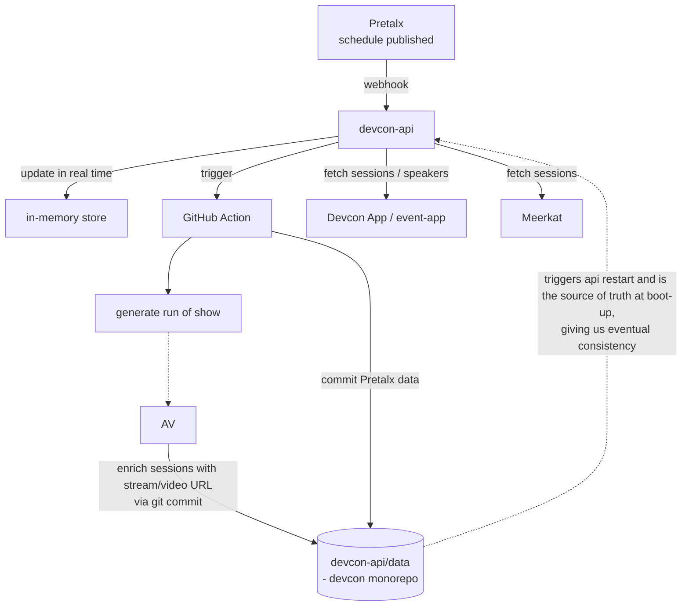

# Devcon AV Stack - Map & Devcon 8 Readiness Assessment

## Context

Ahead of Devcon 8 (Mumbai/India), we need a clear picture of everything AV-related in
`efdevcon/monorepo`: livestreams, video delivery, graphic generation, and the data
pipelines that feed the archive. The repo contains a handover document
([`docs/now.md`](https://github.com/efdevcon/monorepo/blob/main/docs/now.md), AV
section pointing to
[`pretalx-pipeline.md`](https://github.com/efdevcon/monorepo/blob/main/docs/av/pretalx-pipeline.md)
alongside this doc) which states the AV enrichment pipeline was never built because
the AV team wasn't formed at the time. This document maps what actually exists,
separates live from dormant, and lists what will break for DC8 if untouched.

Sections 1-9 are assessment only; §10 suggests sequencing and §11 records the
architecture recommendations from the review discussion. Decisions belong with the
AV team.

_Assessment date: 2026-08-04. Items marked ✅ FIXED were implemented the same day -
§12 is the changelog. On 2026-08-05 the §2c app decision landed (event-app) and its AV
surface was built - §12c is that changelog. On 2026-08-10 compression + CDN cache
headers landed on devcon-api (the §11.7 insurance) - §12e is that changelog. Reviewed
2026-08-10: findings re-verified against the repo and live API, GitHub links added,
superseded statements corrected in place. Line references may drift as code changes._

---

## 1. Architecture in one paragraph

There is **no database** and **no media infrastructure of Devcon's own**.

- **Hosting:** the API (`api.devcon.org`) runs on **Render**. Committing to
  [`devcon-api/data/`](https://github.com/efdevcon/monorepo/tree/main/devcon-api/data)
  redeploys it (Render boots the new instance in parallel, so no downtime), which is
  how git-committed changes reach the running API.
- **Data layer:** `devcon-api` has no Prisma/SQLite/Postgres. Synced data lives as plain
  JSON committed into
  [`devcon-api/data/`](https://github.com/efdevcon/monorepo/tree/main/devcon-api/data),
  loaded into memory at boot by
  [`devcon-api/src/data/store.ts`](https://github.com/efdevcon/monorepo/blob/main/devcon-api/src/data/store.ts).
  Between deploys the data is **also updated on the fly**: the Pretalx webhook swaps
  the in-memory store in real time
  ([`hooks.ts`](https://github.com/efdevcon/monorepo/blob/main/devcon-api/src/controllers/hooks.ts)
  → `store.ts`), and `PUT /sessions/sources/:id` writes to memory immediately -
  the git commit is for the next boot (eventual consistency - AV commits are even
  tagged `[skip deploy]`,
  [`sessions.ts`](https://github.com/efdevcon/monorepo/blob/main/devcon-api/src/controllers/sessions.ts),
  so they don't force a restart). Writes go back to **git** via
  [`devcon-api/src/services/github.ts`](https://github.com/efdevcon/monorepo/blob/main/devcon-api/src/services/github.ts)
  (`CommitSession`). Git is the system of record.
- **Playback:** no player library exists anywhere (no react-player/video.js/hls.js/plyr/
  vidstack - verified against every `package.json`). No HLS, RTMP, DASH, WebRTC, Mux, or
  Cloudflare Stream. Everything is third-party iframes (YouTube, StreamEth,
  Etherna/Swarm, stm.live) plus one raw `<video>` in the archive's IPFS tab.
- **Ingestion:** Pretalx (`cfp.devcon.org`) is the source of truth for schedule; YouTube
  is the system of record for video. AV enrichment happens via
  `PUT /sessions/sources/:id`, which updates memory and commits to git.
- **Consumers of the API:** devcon-app (DC7) and
  [event-app](https://github.com/efdevcon/monorepo/tree/main/event-app) (the DC8 PWA -
  sessions/speakers/livestreams), the archive
  ([`archive/`](https://github.com/efdevcon/monorepo/tree/main/archive)), devcon.org
  (`/dips`), devcon-ai (RAG embeddings built during sync), and **Meerkat** (session
  Q&A - fetches sessions from the API, and the sync script pings it on schedule
  changes; see §3 #11).

Consequence: "building the AV pipeline" is entirely a **data** problem. No encoding,
storage, or player work is implied.

## 2. The flow that exists today

High level (matches the internal architecture diagram, plus the consumers):



In detail:

```
Pretalx (cfp.devcon.org, schedule published)
  └─webhook──> POST /hooks/pretalx/:eventId/schedule   (devcon-api/src/controllers/hooks.ts)
                 ├─ in-memory atomic swap (store.ts, zero downtime)
                 └─ TriggerWorkflow() per WORKFLOW_MAP (hooks.ts)
                      ├─ sync-pretalx-<event>.yml ──> commits devcon-api/data/ ──> API restart
                      │                            ├─> devcon-ai `sync:sessions` (RAG embeddings)
                      │                            └─> POST meerkat.events sync ping (devcon-7 only, see §3 #11)
                      └─ run-of-show-<event>.yml  ──> rebuilds Google Sheet for AV team

AV / encoding vendor
  └─PUT /sessions/sources/:id (API key) ──> memory + CommitSession() to git
                                            fields: sources_{youtubeId,ipfsHash,swarmHash,
                                                    livepeerId,streamethId}, transcript_vtt,
                                                    transcript_text, duration
```

Details that matter:

- `WORKFLOW_MAP` in
  [`hooks.ts`](https://github.com/efdevcon/monorepo/blob/main/devcon-api/src/controllers/hooks.ts)
  wires **devcon8's and test-devcon-8's run-of-show to regenerate on every schedule
  publish**; devcon-7's does not (sync only).
- The webhook also accepts slug-less `POST /hooks/pretalx/schedule` and resolves the
  event from the Pretalx slug in the payload. ✅ FIXED 2026-08 (§12): it used to
  **fall back to `devcon-7`** for an unknown slug, silently resyncing the wrong
  event; unknown slugs now get a 400 + warning log.
- The webhook **acks 204 immediately and syncs detached** (✅ 2026-08-19, §12f):
  the plugin sends the POST from inside Pretalx's release request, so holding the
  response for the sync stalled — and rolled back — orga-UI releases.
- Both sync workflows also have a **monthly cron fallback** (`0 23 30 * *`), so data
  refreshes even if no schedule is published.
- The devcon-7 sync additionally runs `createPresentations()` (Google Slides) and a
  glossary build - gated `if (eventId === 'devcon-7')` in
  [`sync-pretalx.ts`](https://github.com/efdevcon/monorepo/blob/main/devcon-api/src/scripts/sync-pretalx.ts).
- **Speaker emails never leave the sync**: each speaker gets
  `hash = HMAC-SHA256(EMAIL_SECRET, email)`
  ([`pretalx.ts`](https://github.com/efdevcon/monorepo/blob/main/devcon-api/src/clients/pretalx.ts))
  so downstream tools can match a signed-in email against confirmed speakers without
  the API exposing addresses. Two implications: rotating `EMAIL_SECRET` changes every
  speaker hash, and if the env var is missing the sync just **warns and skips
  hashing** - no hard failure. No in-repo consumer today (the visa speaker form
  queries Pretalx directly), but treat the secret as stable.
- **AV write auth**: `PUT /sessions/:id` and `PUT /sessions/sources/:id` check an API
  key against `SERVER_CONFIG.API_KEYS`
  ([`src/middleware/apikey.ts`](https://github.com/efdevcon/monorepo/blob/main/devcon-api/src/middleware/apikey.ts)).
  ✅ IMPROVED 2026-08 (§12): the key is now accepted via the `x-api-key` **header**
  (preferred - query-string keys land in Render/proxy access logs); `?apiKey=` still
  works for existing tooling. Issue DC8 vendor keys with the header form.
- **Pretalx instance:** everything lives on `https://cfp.devcon.org` (migrated from
  `mum.speakat.xyz` in Aug 2026; `speak.devcon.org` retired before that). All
  `PRETALX_BASE_URI` entries in
  [`devcon-api/src/utils/config.ts`](https://github.com/efdevcon/monorepo/blob/main/devcon-api/src/utils/config.ts)
  now point there. Gotcha: a stale base URL is worse than a broken one - fetch
  **strips the `Authorization` header on the cross-origin 301 redirect**, so the sync
  runs anonymously and private events 401 while public ones keep working. The secret
  name `PRETALX_API_KEY_MUMBAI` predates the rename and is kept as-is.

### 2a. Field recap: everything the AV team writes, and how

Three write paths. Both endpoints authenticate with an API key (`x-api-key` header
preferred, `?apiKey=` query still accepted) and commit to git with `[skip deploy]`.

**Path A - `PUT /sessions/sources/:id`** (the day-of enrichment endpoint,
[`sessions.ts`](https://github.com/efdevcon/monorepo/blob/main/devcon-api/src/controllers/sessions.ts)).
✅ FIXED 2026-08 (§12): now **patch semantics** - omitted fields keep their current
value, an explicit `''` clears (it used to be a full replace where a partial payload
wiped everything unsent). Bumps the version of the session's own event (the devcon-7
hardcode of blocker #1 is gone).

| Field | Consumed by |
|---|---|
| `sources_youtubeId` | YouTube embed in devcon-app + archive; `yt.ts` thumbnail/description push; coverage stats |
| `sources_streamethId` | StreamEth iframe tab |
| `sources_swarmHash` | Swarm player (devcon-app only; also gates the player-switcher pills, §7.3) |
| `sources_ipfsHash` | Archive IPFS tab (dead gateway, §6) - vestigial since DC6 |
| `sources_livepeerId` | Nothing (1 session ever had one) |
| `transcript_vtt` | Nothing - never parsed anywhere (§8) |
| `transcript_text` | LLM/AI consumption only |
| `duration` | Duration display in app + archive |

**Path B - `PUT /sessions/:id`** (generic session update). True partial merge - only
sent keys change, unknown keys are rejected. Can update *any* existing session field,
notably `resources_slides`, title/description corrections, `slot_*` moves.
✅ FIXED 2026-08 (§12): it now bumps the event version too (it used not to, so
corrections could serve stale to clients and OG cards indefinitely).

**Path C - hand-edited git commit** (no endpoint). Per-room livestream config in
[`data/rooms/<event>/*.json`](https://github.com/efdevcon/monorepo/tree/main/devcon-api/data/rooms):
`youtubeStreamUrl_1..4` (one per event day) and `translationUrl`. Survives Pretalx
syncs only via spread order (§5.3).

## 2b. Automation inventory - every Pretalx/AV entry point

One table for everything that runs (or is supposed to run) without a human editing JSON
by hand. "Manual" means someone runs a pnpm script locally.

| Automation | What it does | Trigger | Event scoping | Status |
|---|---|---|---|---|
| Pretalx webhook ([`hooks.ts`](https://github.com/efdevcon/monorepo/blob/main/devcon-api/src/controllers/hooks.ts)) | Full resync into memory + dispatches workflows | Pretalx "schedule published" plugin webhook | Slug-resolved; unknown slugs rejected with 400 (✅ fixed, §12) | Live |
| [`sync-pretalx{,-devcon8,-test-devcon-8}.yml`](https://github.com/efdevcon/monorepo/tree/main/.github/workflows) | Commits `devcon-api/data/` to git (→ Render redeploy), builds devcon-ai RAG embeddings, pings Meerkat | Webhook-dispatched + monthly cron (`0 23 30 * *`) | devcon-7 / devcon8 / test-devcon-8 | Live |
| [`run-of-show-{devcon8,test-devcon-8}.yml`](https://github.com/efdevcon/monorepo/tree/main/.github/workflows) | Rebuilds the AV team's Google Sheet | Webhook-dispatched + manual dispatch | devcon8 / test-devcon-8 (devcon-7 not wired) | Live |
| Meerkat ping (`notifyClients()` in [`sync-pretalx.ts`](https://github.com/efdevcon/monorepo/blob/main/devcon-api/src/scripts/sync-pretalx.ts)) | POST sync ping to `meerkat.events` | Runs inside the sync script | **devcon-7 only, URL hardcoded** (§3 #11) | Live (DC7 only) |
| `pnpm yt` → `syncThumbnails()` ([`yt.ts`](https://github.com/efdevcon/monorepo/blob/main/devcon-api/src/scripts/yt.ts)) | Renders `devcon.org/api/social/av/:id` at 1920×1080 and pushes via `youtube.thumbnails.set()` (105/run for quota) | Manual, interactive browser OAuth | `sessions/devcon-7` hardcoded | Manual |
| `pnpm yt` → `syncDescriptions()` | Rewrites YouTube **titles** (truncated to fit "by <speaker>" + a hardcoded `\| Devcon SEA` suffix into 100 chars) and **descriptions** (from session description + tags), ledger [`youtube-descriptions.json`](https://github.com/efdevcon/monorepo/blob/main/devcon-api/src/scripts/youtube-descriptions.json) | **Commented out** in `main()` | devcon-7 + SEA branding hardcoded | Disabled |
| `pnpm import:yt` ([`import-yt.ts`](https://github.com/efdevcon/monorepo/blob/main/devcon-api/src/scripts/import-yt.ts)) | Imports YouTube playlists ([`data/playlists.json`](https://github.com/efdevcon/monorepo/blob/main/devcon-api/data/playlists.json)) into session JSONs - how devconnect-arg's 418 sessions got in | Manual, Google **service account** | `eventId = 'devconnect-arg'` hardcoded | Manual |
| `pnpm stats:v` ([`stats-video.ts`](https://github.com/efdevcon/monorepo/blob/main/devcon-api/src/scripts/stats-video.ts)) | AV source-coverage report | Manual | ✅ Takes an event id since 2026-08 (§12) | Manual |
| devcon.org social/OG routes | On-demand edge-rendered cards with a Supabase render cache (see §4) | HTTP, `devcon.org/api/social/*` | DC7 placeholder art in `dc8/` (asset swap pending, #6) | Live (§12d) |
| [`generate-images.yml`](https://github.com/efdevcon/monorepo/blob/main/devcon-api/.github/workflows/generate-images.yml) (nested `.github`) | DC6 lower-thirds + social cards | Hourly cron in a nested `.github` GitHub never executes | DC6 | Dead (§8) |
| `pnpm slides` ([`slides.ts`](https://github.com/efdevcon/monorepo/blob/main/devcon-api/src/scripts/slides.ts)) | Google Slides migration | Manual | `data/slides/` gone → throws | Dead (§9) |

## 2c. The app question: devcon-app (DC7) vs event-app (DC8 PWA)

✅ DECIDED 2026-08-05: **event-app carries DC8's AV surface** (see §12c for what was
built). The handover doc positions
[`event-app`](https://github.com/efdevcon/monorepo/tree/main/event-app) as the new PWA
going forward (offline-first: Dexie + SWR, Serwist service worker, optional native
iOS/Android via Capacitor - see
[`event-app/docs/architecture.md`](https://github.com/efdevcon/monorepo/blob/main/event-app/docs/architecture.md)).
devcon-app stays DC7-only; its blocker #3 is moot.

- **event-app's AV surface now exists** (it originally had none - the zod models
  stripped the AV fields at validation). Today: `SessionSchema` carries `sources_*`,
  `RoomSchema` carries `youtubeStreamUrl_1..4` / `translationUrl`
  ([`event-app/src/data/models/`](https://github.com/efdevcon/monorepo/tree/main/event-app/src/data/models)),
  the provider maps them (normalising the API's `''` to `undefined`), and
  [`SessionMedia.tsx`](https://github.com/efdevcon/monorepo/blob/main/event-app/src/components/schedule/SessionMedia.tsx)
  embeds recordings (YouTube, else StreamEth) with a live-stream fallback selected by
  event-relative day indexing (`eventDayIndex`/`streamUrlForDay` in
  [`components/schedule/utils.ts`](https://github.com/efdevcon/monorepo/blob/main/event-app/src/components/schedule/utils.ts)),
  plus a "Live translation available" link while a session is live/imminent and its
  room has a `translationUrl`.
- **Data source:** the active provider is
  [`DevconApiProvider`](https://github.com/efdevcon/monorepo/blob/main/event-app/src/data/providers/devcon-api.provider.ts)
  → devcon-api, with a runtime-switchable dataset (`?dataset`) offering
  `test-devcon-8`, `devcon8` and `devcon-7`
  ([`event-app/src/data/dataset.ts`](https://github.com/efdevcon/monorepo/blob/main/event-app/src/data/dataset.ts)).
  A second, currently **inactive** provider
  ([`devcon.provider.ts`](https://github.com/efdevcon/monorepo/blob/main/event-app/src/data/providers/devcon.provider.ts))
  reads Pretalx directly through `/api/pretalx` - a server-side proxy hardcoded to
  `EVENT_SLUG = 'test-devcon-8'`
  ([`route.ts`](https://github.com/efdevcon/monorepo/blob/main/event-app/src/app/api/pretalx/route.ts));
  flip that slug if the provider is ever reactivated.
- **Room screens (venue signage) live here now:** `/room-screens/[id]` renders a
  per-room now/next display with a QR code into the app. ✅ As of 2026-08-05 the
  "Resources / Livestreams" box also renders a second **"Watch livestream" QR** for
  the room's stream on the current conference day (anchored on *now* via the mockable
  clock, unlike SessionMedia which anchors on the session's own day - intentional).
  Hidden when no stream URL exists; degrades to no-QR offline. devcon-app has the DC7
  predecessor at
  [`devcon-app/src/pages/room-screens/[id].tsx`](https://github.com/efdevcon/monorepo/blob/main/devcon-app/src/pages/room-screens/%5Bid%5D.tsx)
  (text-only, no QR).
- **Meerkat's user-facing half** is in event-app: `POST /api/meerkat` gates on a
  Supabase session + paid Pretix ticket, then hands off with a 5-min HS256 JWT
  (secret shared with Meerkat). The schedule-sync half is §3 #11.
- event-app's `/api/admin/{datasets,search,inference}` routes are the debugging UI for
  the devcon-ai RAG stack (per the handover doc).
- devcon-app meanwhile shows a dismissable "Devcon 8 prep" banner but is otherwise
  still fully DC7-wired.

## 3. Devcon 8 blockers - independent hardcodes that fail silently

Ranked by severity. Each is a separate fix.

| # | Issue | Location | Effect |
|---|---|---|---|
| 1 | ✅ FIXED 2026-08 (§12) - `updateEventVersion('devcon-7')` hardcoded in the AV ingestion endpoint | [`sessions.ts`](https://github.com/efdevcon/monorepo/blob/main/devcon-api/src/controllers/sessions.ts) | Every DC8 video `PUT` bumped **DC7's** cache-bust token; DC8 clients never saw new videos. |
| 2 | `devcon8` rooms have no `youtubeStreamUrl_*` / `translationUrl` fields (re-verified 2026-08-10) | [`devcon-api/data/rooms/devcon8/`](https://github.com/efdevcon/monorepo/tree/main/devcon-api/data/rooms/devcon8) | All DC8 sessions render "No livestream available". |
| 3 | ✅ RESOLVED BY DECISION 2026-08-05 (§2c, §12c) - day→stream mapping hardcoded to Bangkok + Nov 12–15 2024 | [`devcon-app/.../sessions/index.tsx`](https://github.com/efdevcon/monorepo/blob/main/devcon-app/src/components/domain/app/dc7/sessions/index.tsx) | DC8 ships on event-app, so this devcon-app hardcode is moot and stays as-is. event-app's replacement uses event-relative UTC-day indexing off `event.startDate`. Caveat: the math assumes `startDate` stays midnight-UTC form - changing it to local-midnight shifts every stream index by one. |
| 4 | ✅ FIXED 2026-08 (§12) - `PRETALX_QUESTIONS_*` IDs were unmapped for `devcon8` / `test-devcon-8` | [`config.ts`](https://github.com/efdevcon/monorepo/blob/main/devcon-api/src/utils/config.ts) | Speaker socials, expertise, audience, tags, keywords all silently empty. |
| 5 | ✅ FIXED 2026-08 (§12) - `submission_type` numeric IDs were hardcoded to DC7's | [`pretalx.ts`](https://github.com/efdevcon/monorepo/blob/main/devcon-api/src/clients/pretalx.ts) | DC8 sessions fell through to the raw Pretalx type name, breaking type filters. |
| 6 | ◐ INFRA REPLACED 2026-08 (§12d), asset swap remaining - social cards were entirely DC7 Bangkok-branded | [`devcon/public/social/dc8/`](https://github.com/efdevcon/monorepo/tree/main/devcon/public/social/dc8) + [`devcon/src/pages/api/social/`](https://github.com/efdevcon/monorepo/tree/main/devcon/src/pages/api/social) | The rendering stack was rebuilt on devcon.org with a Supabase cache; the DC7 art was copied to `dc8/` as placeholders by explicit decision. Remaining for the rebrand: swap the `dc8/` PNGs (same filenames, drop-in) and update the hardcoded "Bangkok, Thailand / 12-15 Nov 2024" block + `Asia/Bangkok` timezone in the two card templates. |
| 7 | ✅ FIXED 2026-08 (§12) - run-of-show rendered times in **UTC** | [`generate-run-of-show.ts`](https://github.com/efdevcon/monorepo/blob/main/devcon-api/src/scripts/generate-run-of-show.ts) | Wrong wall-clock for stage crew (IST is UTC+5:30). |
| 8 | ✅ FIXED 2026-08 (§12) - `stats-video.ts` was hardcoded to devcon-7 + Nov dates | [`stats-video.ts`](https://github.com/efdevcon/monorepo/blob/main/devcon-api/src/scripts/stats-video.ts) | The only AV coverage report couldn't run for DC8; now `pnpm stats:v <eventId>`. |
| 9 | `yt.ts` uses `@google-cloud/local-auth` (interactive browser OAuth) | [`google.ts`](https://github.com/efdevcon/monorepo/blob/main/devcon-api/src/clients/google.ts) | Cannot run in CI; YouTube push is manual-only. Nuance: a service-account path exists (`AuthenticateServiceAccount`, used by `import-yt.ts`) but service accounts can only *read* YouTube - writes (thumbnails/titles) need the channel owner's OAuth, so CI would require a stored refresh token. |
| 10 | ✅ **FIXED + VERIFIED (2026-08-13)** — end-to-end test now passes: `PUT /sessions/sources/:id` on test-devcon-8 returns 204 and the `[skip deploy]` commits land on main. Three bugs were found and fixed along the way: (1) `SessionToJson` assumed DB-era comma-string `tags`/`keywords` and 500'd on the file-store's arrays; (2) session ids are NOT unique across events (test-devcon-8 is a devcon-7 clone) and reads resolved via `sessionMap` (last event wins) while writes used array `findIndex` (first event wins) — an AV write briefly wiped a devcon-7 archive session's AV fields (restored same day); `updateSession` now resolves through the same map as `getSession`; (3) commits serialized the hydrated `slot_room` object into data files — now stripped. Verify with `pnpm av:test-write` (devcon-api) — it aborts if the test session resolves outside test-devcon-8. **TOKEN MIGRATED OFF PERSONAL ACCOUNTS (2026-08-13)**: Render `GITHUB_TOKEN` is now a classic PAT on the **`devcon-website` machine account** (scope `public_repo` only; the account holds Write on the monorepo). Verified end-to-end: `pnpm av:test-write` returns 204/204, both `[skip deploy]` commits land on main, and the commits are **committed by `devcon-website`** — proof Render uses the machine credential, not a person's. The token can also read the Actions API (all 4 `sync-pretalx` workflows visible), so webhook-driven `workflow_dispatch` is covered. No individual's offboarding can break the AV pipeline any more. Also fixed while testing: two writes to the same session within seconds could 409 on a stale contents-API sha and surface as a 500 — `CommitSession` now re-reads the sha and retries (deployed, verified). REMAINING: `PRETALX_API_KEY(_MUMBAI)` repo secrets still need a confirmed owner; set a calendar reminder for the token's expiry. Recommended follow-up: regenerate test-devcon-8 with prefixed session ids so cross-event id ambiguity disappears entirely. | [`github.ts`](https://github.com/efdevcon/monorepo/blob/main/devcon-api/src/services/github.ts) (`TriggerWorkflow` and `CommitSession`), via `GITHUB_TOKEN` in the API's Render env (the workflow files themselves use the repo-scoped `secrets.GITHUB_TOKEN`, which is fine) | Webhook→workflow triggering and AV session commits die when the account is deprovisioned. `PRETALX_API_KEY(_MUMBAI)` repo secrets need an owner too. |
| 11 | Meerkat schedule sync ping gated to devcon-7 **and** hardcoded to `meerkat.events/api/v1/sync/devcon/devcon-7` (re-verified 2026-08-10) | [`sync-pretalx.ts`](https://github.com/efdevcon/monorepo/blob/main/devcon-api/src/scripts/sync-pretalx.ts) | DC8 schedule publishes never notify Meerkat (session Q&A), so its session list goes stale. Needs an event-parameterised endpoint agreed with the Meerkat team (see [`docs/meerkat.md`](https://github.com/efdevcon/monorepo/blob/main/docs/meerkat.md)). |
| 12 | ✅ FIXED 2026-08 (§12) - `devcon8` event metadata was empty | [`devcon-api/data/events/devcon8.json`](https://github.com/efdevcon/monorepo/blob/main/devcon-api/data/events/devcon8.json) | The API served a nameless, dateless DC8 event; now hand-authored (title, dates, venue). Event metadata has no sync - it stays hand-authored. |

## 4. Social/OG cards and the YouTube thumbnail pipeline

Since §12d (2026-08-05), the cards render on **devcon.org** with a Supabase render
cache. [`yt.ts`](https://github.com/efdevcon/monorepo/blob/main/devcon-api/src/scripts/yt.ts)
fetches `devcon.org/api/social/av/{id}` at 1920×1080 and pushes it straight to
`youtube.thumbnails.set()` - that route is the video thumbnail renderer, not just an
OG endpoint. Idempotency ledger:
[`youtube-thumbnails.json`](https://github.com/efdevcon/monorepo/blob/main/devcon-api/src/scripts/youtube-thumbnails.json)
(581 IDs), throttled `.slice(0, 105)` per run for YT quota.

Current route inventory:

| Route | Size | Consumed by |
|---|---|---|
| `devcon.org/api/social/av/[id]` | 1920×1080 | `yt.ts` → YouTube thumbnails |
| `devcon.org/api/social/schedule/[id]` | 1200×630 | devcon-app session share cards (`?v=` cache-bust); devcon.org [`Hero.tsx`](https://github.com/efdevcon/monorepo/blob/main/devcon/src/components/domain/index/hero/Hero.tsx) schedule card |
| `devcon.org/api/social/schedule-u/[id]` | 1200×630 | personal-schedule share cards |
| `devcon-social.netlify.app/[name]/opengraph-image` | ticket | the original DC7 attendee "social ticket" (legacy, still on the old [`social-ticket`](https://github.com/efdevcon/monorepo/tree/main/social-ticket) app) |
| `devcon-social.netlify.app/av/[id]/opengraph-image` | 1920×1080 | archive video OG (legacy, old app) |

The devcon.org routes live in
[`devcon/src/pages/api/social/`](https://github.com/efdevcon/monorepo/tree/main/devcon/src/pages/api/social)
on the shared
[`og-cache.ts`](https://github.com/efdevcon/monorepo/blob/main/devcon/src/services/og-cache.ts)
service (details in §12d). They default to `https://api.devcon.org` - the old app's
`localhost:4000` `API_URL` default footgun is gone for these routes, but still applies
to the legacy `social-ticket` app while it hosts the two remaining routes.

Cross-link with blocker #1: devcon-app cache-busts the schedule OG URL with
`?v=${useEventVersion()}`. Before the §12 fix, `PUT /sessions/sources/:id` bumped the
wrong event's version, which also kept DC8 share cards pinned to stale renders - both
sides of that are resolved.

`yt.ts` also contains a currently-disabled **YouTube title + description rewriter**
(`syncDescriptions()`, commented out in `main()`): it retitles videos to fit
`<title> by <speaker> | Devcon SEA` into YouTube's 100-char limit and regenerates
descriptions from session data (ledger:
[`youtube-descriptions.json`](https://github.com/efdevcon/monorepo/blob/main/devcon-api/src/scripts/youtube-descriptions.json),
578 IDs). If revived for DC8: the `' | Devcon SEA'` suffix, the `sessions/devcon-7`
source, and the description boilerplate ("Devcon SEA was held in Bangkok… Nov 12 -
Nov 15, 2024") are all hardcoded.

Historic duplicate:
[`sessions.ts`](https://github.com/efdevcon/monorepo/blob/main/devcon-api/src/controllers/sessions.ts)
(`GET /sessions/:id/image`) launches **Puppeteer** to screenshot a Handlebars
template, and has an unreachable 1920×1080 `'video'` branch (`imageType` hardcoded
`'og'`) - someone intended it to do exactly what the `av` card route now does.
`puppeteer` pinned at `18.2.1`, DC6-era track names. Dead.

## 5. Destructive-behaviour risks (live footguns)

1. **Run-of-show destroys AV team's manual work.** `applyFormatting()` unmerges and
   rewrites all formatting, and tabs are destructively rebuilt every run
   ([`generate-run-of-show.ts`](https://github.com/efdevcon/monorepo/blob/main/devcon-api/src/scripts/generate-run-of-show.ts)).
   Columns `MODERATOR`, `SLIDES / MEDIA`, `MIC CONFIG`, `INTERNAL NOTES`,
   `PUBLIC NOTES` are intentionally blank for AV to fill - and for **devcon8 this
   regenerates automatically on every Pretalx publish**. The handover doc flags this
   as unresolved. Options: make the sheet immutable and document it, or split
   generated vs. hand-edited columns onto separate tabs.
2. **Sync can delete committed data.**
   [`sync-pretalx.ts`](https://github.com/efdevcon/monorepo/blob/main/devcon-api/src/scripts/sync-pretalx.ts)
   `unlinkSync`s any local room/session file whose id is absent from the Pretalx
   response. A partial API response deletes real data. Partly mitigated by
   `concurrency: cancel-in-progress: false` and `pull --rebase --autostash -X theirs`.
3. **Livestream config survives only by spread order.** Room stream URLs persist across
   sync purely because of `{...roomFs, ...room}` in `sync-pretalx.ts` (Pretalx
   never returns those keys). Reversing that spread silently wipes livestream config.
4. ✅ FIXED 2026-08 (§12) **A schedule publish used to drop AV enrichment from the
   *serving* copy** until the next redeploy - certain to bite during the event.
   `replaceEventSessions` now carries the enriched fields over (see §12).
5. ✅ FIXED 2026-08 (§12) **A partial enrichment `PUT` used to erase the rest** -
   now patch semantics (§2a Path A).

## 6. Source coverage on disk

Counts re-verified 2026-08-10:

| Event | Sessions | YouTube | IPFS | Swarm | StreamEth | Livepeer | Transcript |
|---|---|---|---|---|---|---|---|
| devcon-0 … 6 | 1,079 | ~all | ~all | ~all | – | – | – |
| **devcon-7** | 650 | 580 | **0** | 555 | 388 | **1** | 367 |
| **devconnect-arg** | 418 | 418 | 0 | 0 | 0 | 0 | 0 |
| **devcon8** | 0 | – | – | – | – | – | – |
| **test-devcon-8** | 5 | 0 | 0 | 0 | 0 | 0 | 0 |

- `devcon8` has no synced sessions yet (schedule not published); `test-devcon-8`
  carries the seeded test sessions from §12c.
- IPFS mirroring **stopped after DC6**, and the gateway in use
  (`cloudflare-ipfs.com`,
  [`archive/.../Video.tsx`](https://github.com/efdevcon/monorepo/blob/main/archive/src/components/domain/archive/Video.tsx))
  is **decommissioned** - so the IPFS tab is broken even for the videos that have
  hashes.
- Swarm is the surviving decentralized mirror (555/650 for DC7), but the archive's Swarm
  player tab is **commented out** - only reachable in devcon-app.
- Livepeer is 1 session. `STREAMING_URL = 'https://live.devcon.org/'` still exported
  from [`devcon/src/utils/constants.ts`](https://github.com/efdevcon/monorepo/blob/main/devcon/src/utils/constants.ts)
  and [`devcon-app/src/utils/constants.ts`](https://github.com/efdevcon/monorepo/blob/main/devcon-app/src/utils/constants.ts)
  with zero consumers.

## 7. Confirmed bugs (independent of DC8)

1. **Slides never render for any session.**
   [`archive/.../Video.tsx`](https://github.com/efdevcon/monorepo/blob/main/archive/src/components/domain/archive/Video.tsx)
   reads `video.slidesUrl`; the API serves `resources_slides`. `slidesUrl` appears in
   **zero** session JSON files. 527 DC7 + 287 DC6 sessions have slides that are
   invisible. [`archive/src/types/index.ts`](https://github.com/efdevcon/monorepo/blob/main/archive/src/types/index.ts)
   is entirely Gatsby-era naming.
2. **Related videos always empty.**
   [`store.ts`](https://github.com/efdevcon/monorepo/blob/main/devcon-api/src/data/store.ts)
   intentionally skips vectorization with the comment *"no client uses it"* - but
   [`archive/src/services/devcon.ts`](https://github.com/efdevcon/monorepo/blob/main/archive/src/services/devcon.ts)
   does call `/sessions/:id/related`. The comment is wrong; the archive silently gets
   nothing (live: 404, re-verified 2026-08-10). The working replacement is
   [`devcon-ai/src/routes/recommend.ts`](https://github.com/efdevcon/monorepo/blob/main/devcon-ai/src/routes/recommend.ts).
3. **Player switcher hidden.**
   [`devcon-app/.../sessions/index.tsx`](https://github.com/efdevcon/monorepo/blob/main/devcon-app/src/components/domain/app/dc7/sessions/index.tsx)
   gates the source pills on `sources_swarmHash`, so YouTube+StreamEth sessions offer
   no choice.
4. **New events invisible in archive search** until
   [`archive/src/hooks/useArchiveSearch.ts`](https://github.com/efdevcon/monorepo/blob/main/archive/src/hooks/useArchiveSearch.ts)
   is hand-edited (hardcoded event list).
5. **Archive playlists are dead code.**
   [`archive/src/services/playlists.ts`](https://github.com/efdevcon/monorepo/blob/main/archive/src/services/playlists.ts)
   + 24 JSON files are never imported by any route, and use the old Gatsby path
   scheme. `Video.tsx` renders a `playlists` prop the page never passes.
6. ✅ FIXED 2026-08 (§12b) **Room ids collide across events in the store.**
   `roomMap` was keyed by bare room id, but ids repeat across event folders, so
   whichever event's folder loaded last silently overwrote the others - live on
   production at the time (DC7 main-stage sessions served another event's room and
   lost their `youtubeStreamUrl_*` config). Fixed by stamping rooms with their event
   folder and namespacing the map key to `eventId/roomId`.
7. **Session ids have the same latent collision** - `sessionMap` is keyed by bare
   slug, and 5 duplicates already exist (test-devcon-8 mirrors 4 DC7 talks;
   `securing-ethereum` exists in devcon-1 and devcon-7), last-loaded wins. Harder to
   fix than rooms because `GET /sessions/:id` is a public bare-id contract
   (archive/app deep links). Not fixed; needs a decision (e.g. prefer the newest
   event on conflict, or event-scoped lookups).
8. **Production `/events` publicly serves three phantom events** (re-verified
   2026-08-10): `0` (stray
   [`data/events/0.json`](https://github.com/efdevcon/monorepo/blob/main/devcon-api/data/events/0.json),
   an artifact of `import-yt.ts` `ensureEventFile()`), `devcon-mumbai-playground`
   (test instance, removed from `PRETALX_INSTANCES` but its data files remain), and
   `test-devcon-8`. `initStore` loads every file in `data/events/` - there is no
   draft/hidden flag. The archive is only shielded by its own hardcoded event list
   (§7.4).

## 8. Buried assets nobody reads

- **1,092 whisper.cpp transcripts** in
  [`devcon-api/data/transcripts/`](https://github.com/efdevcon/monorepo/tree/main/devcon-api/data/transcripts)
  `devcon-{0..6}/` (`ggml-base.en`, full timestamp arrays). **Zero readers** - no
  import, route, or build step touches that directory.
- **~280 MB of DC7 per-room live-caption CSVs** in `data/transcripts/devcon-7/` -
  `transcriptions-<room>.csv`, one per stage, with `Recognition` plus **10 translation
  columns** (`bn-IN, fil-PH, hi-IN, id-ID, km-KH, ms-MY, my-MM, th-TH, vi-VN, zh-CN`).
  Raw AV-booth output. Nothing joins them back to sessions by
  `slot_start`/`slot_end`. `breakout-1`/`breakout-2` are header-only (nothing
  captured).
- **`transcript_vtt` is never parsed.** No `.vtt` parser, no `<track>` element, no
  caption rendering anywhere in the monorepo. Some values are the literal string
  `"No VTT link provided"`. Only `transcript_text` is used, and only for LLM
  consumption.
- **Transcripts are not in the current RAG index.**
  [`devcon-ai/scripts/sync-sessions.ts`](https://github.com/efdevcon/monorepo/blob/main/devcon-ai/scripts/sync-sessions.ts)
  builds embeddings from title/speakers/tags/description only; it does carry
  `youtube_id` in metadata. The DC7 transcript corpus is reachable only via the older
  `devcon-api` OpenAI Assistants vector store.
- [`devcon-api/generated/`](https://github.com/efdevcon/monorepo/tree/main/devcon-api/generated) -
  1,466 committed files (`_youtube.txt` ×413, `_1080.png` ×517, `_social.png` ×519) of
  DC6 lower-thirds and social cards, produced by
  [`generate-images.yml`](https://github.com/efdevcon/monorepo/blob/main/devcon-api/.github/workflows/generate-images.yml)
  (hourly cron, Node 14) running `yarn scripts:generator` - **a script that exists in
  no `package.json`**, in a nested `.github` GitHub never executes. Fully broken;
  artifacts stale.
- [`devcon-api/data/audio/devcon-6/`](https://github.com/efdevcon/monorepo/tree/main/devcon-api/data/audio/devcon-6) -
  7 mp3s (DC6 opening ceremonies) powering `GET /rss/podcast`. Abandoned experiment.
- [`devcon-api/data/edge-cases.json`](https://github.com/efdevcon/monorepo/blob/main/devcon-api/data/edge-cases.json) -
  hand-maintained notes on YouTube playlists that `import:yt` couldn't ingest (channel
  pages instead of playlists, etc.). Zero code readers; useful context if the
  devconnect-arg import is ever re-run.

## 9. Dormant / dead inventory (safe-to-delete candidates)

- [`devcon-api/src/scripts/encrypt.ts`](https://github.com/efdevcon/monorepo/blob/main/devcon-api/src/scripts/encrypt.ts) -
  not in `package.json`, `data/accounts/` gone.
- [`devcon-api/src/services/email.ts`](https://github.com/efdevcon/monorepo/blob/main/devcon-api/src/services/email.ts) -
  nodemailer SMTP sender with three templates (incl. `accreditation-confirmation`);
  **zero importers** in `src/`. Leftover from the removed account system.
- [`devcon-api/src/utils/`](https://github.com/efdevcon/monorepo/tree/main/devcon-api/src/utils)
  `{profile,zupass,web3}.ts` - zero importers each; more account-system remnants
  (`utils/account.ts` by contrast is live, used by the Pretalx and DIPs clients).
- [`devcon-api/src/scripts/slides.ts`](https://github.com/efdevcon/monorepo/blob/main/devcon-api/src/scripts/slides.ts) -
  `data/slides/` doesn't exist, so `migrateSlides()` throws; `exportSlides()`
  commented out.
- [`devcon-api/src/clients/recommendation.ts`](https://github.com/efdevcon/monorepo/blob/main/devcon-api/src/clients/recommendation.ts)
  + `data/vectors/` - deliberately disabled.
- [`devcon-api/src/types/schedule.ts`](https://github.com/efdevcon/monorepo/blob/main/devcon-api/src/types/schedule.ts) -
  Prisma-shaped `{connect:{id}}` payloads, fossilized; live replacement is
  `pretalxToStoreData()` in `hooks.ts`.
- [`devcon-api/src/services/at-slurper/main.ts`](https://github.com/efdevcon/monorepo/blob/main/devcon-api/src/services/at-slurper/main.ts) -
  hardcoded mock events + Notion DB id, and it **runs on API boot** (imported for
  side effects in
  [`controllers/at-slurper.ts`](https://github.com/efdevcon/monorepo/blob/main/devcon-api/src/controllers/at-slurper.ts)).
- [`atproto-slurper/slurper/server.ts`](https://github.com/efdevcon/monorepo/blob/main/atproto-slurper/slurper/server.ts) -
  firehose call commented out in both branches; hardcoded cursor override in millis
  where Jetstream expects microseconds; `backfillData()` fully commented out. Only the
  HTTP endpoints are live.
- [`devcon-ai/src/routes/generate-image.ts`](https://github.com/efdevcon/monorepo/blob/main/devcon-ai/src/routes/generate-image.ts)
  + `base-model.ts` - `readFileSync` reference PNGs (`mumbai-character.png`,
  `base-model.png`, `dc8-bg.png`) that **don't exist** → ENOENT on any request.
  `generate-image.ts` is the sole consumer of `@imgly/background-removal-node`.
- [`devcon-ai/src/lib/replicate.ts`](https://github.com/efdevcon/monorepo/blob/main/devcon-ai/src/lib/replicate.ts) -
  zero importers, `AVATAR_PROVIDER` referenced nowhere, `replicate` not in
  `package.json`.
- Workflows ([`/.github/workflows/`](https://github.com/efdevcon/monorepo/tree/main/.github/workflows)):
  `run-of-show-devcon-mumbai-playground.yml` and
  `sync-pretalx-devcon-mumbai-playground.yml` (scripts don't exist; instance removed
  from `PRETALX_INSTANCES`), `ai-content-prep.yml` (`on: push` commented out, `yarn`
  in a pnpm repo), `devcon-db-cleanup.yml` (no DB any more). (`devcon-archive.yml`,
  listed here previously, has since been deleted.)
- [`devcon-app/src/pages/streams.tsx`](https://github.com/efdevcon/monorepo/blob/main/devcon-app/src/pages/streams.tsx) -
  ops stream wall, gated on `youtubeStreamUrl_4` (DC7 day 4).
- `devconnect-app` stages pages - replaced by stubs linking to
  `devconnect.org/#videos`; real code sits in `page_backup.tsx` with ~20 commented-out
  YouTube URLs from live hand-editing.

## 10. Suggested sequencing (for discussion with the AV team)

**Before DC8 content exists** - unblock the pipeline:
1. ✅ DONE 2026-08 (§12) - the `'devcon-7'` hardcode and the webhook memory-merge
   gap (§5.4) are fixed; the enrichment path is solid (§11.5).
2. ✅ DONE 2026-08 (§12) - `PRETALX_QUESTIONS_*` and `submission_type` IDs mapped
   for `devcon8` and `test-devcon-8` (#4, #5).
3. ✅ DONE 2026-08-13 - `GITHUB_TOKEN` (Render) migrated to the `devcon-website`
   machine account and the AV write path verified end-to-end (#10). Still to do:
   reconfirm ownership of the `PRETALX_API_KEY(_MUMBAI)` secrets against
   cfp.devcon.org.
4. Decide run-of-show mutability policy before the DC8 CFP schedule publishes (§5.1) -
   this is a process decision, not a code one.
5. Agree an event-parameterised sync endpoint with the Meerkat team and un-gate
   `notifyClients()` (#11).

**Before DC8 doors open** - livestream surface:
6. ✅ DONE 2026-08-05 (§12c) - **event-app carries DC8's AV surface** (§2c). Schemas
   extended, livestream/recording embed + translation link + room-screen stream QR
   built and verified headlessly. devcon-app's #3 hardcode left as-is (moot).
7. Event metadata: ✅ DONE 2026-08 (§12) - `devcon8.json` authored (#12). Room
   stream fields (#2) still pending (need the DC8 YouTube channels).
8. ◐ HALF DONE 2026-08 (§12d) - `social-ticket` replaced by cached devcon.org routes;
   remaining: swap the `dc8/` placeholder art + the hardcoded DC7 location/date/timezone
   in the card templates (#6).
9. ✅ DONE 2026-08 (§12) - run-of-show UTC → event-local time (#7).
10. ✅ DONE 2026-08 (§12) - `stats-video.ts` takes an event id (#8).

**Independent of DC8** - cheap credibility wins:
11. `slidesUrl` → `resources_slides` (§7.1). One-line fix, unlocks 814 sessions' slides.
12. Either build the `/related` vectors or point the archive at
    `devcon-ai/recommend` (§7.2).
13. Swap the dead `cloudflare-ipfs.com` gateway (§6).

## 11. Architecture recommendations (from the review discussion)

Guiding constraint: **during the event the infra must not go down, no matter what** -
Pretalx being slow or venue internet dropping are expected, not exceptional.

1. **Keep the serving architecture as is.** Its accidental genius is that nothing at
   runtime depends on Pretalx: the API serves from memory, boots from git, and only
   talks to Pretalx on a schedule publish. If Pretalx is slow or down mid-event,
   nothing user-facing degrades - updates just wait. A database or a live-Pretalx
   dependency would both be steps backward on availability. Client-side resilience is
   covered by event-app's offline-first design (Dexie + SWR).
2. **"Pretalx as source of truth" - adopt as an editing surface, not a serving path.**
   Pretalx custom fields are fine for anything decided *before* the event (room stream
   URLs, translation URLs), ingested at sync time - that would also kill the
   hand-edited room-JSON overlays (#2). But never let a consumer read Pretalx at
   runtime (this includes not activating event-app's dormant direct-Pretalx provider
   for the event).
3. **Keep `PUT /sessions/sources/:id` for day-of enrichment.** It updates memory
   instantly, commits to git for the next boot, doesn't touch Pretalx, triggers no
   resync, and can't collide with the run-of-show sheet. Moving day-of enrichment into
   Pretalx doesn't fit its update model: the webhook only fires on schedule publish, so
   real-time updates would mean constant re-publishes (each one a full resync that also
   destroys the AV team's run-of-show edits, §5.1) or a new answers-poller - more
   infra, not less.
4. **Rejected: dual-writing enrichment to Pretalx custom fields.** Technically possible
   without a resync (`POST/PATCH /api/events/{event}/answers/`), but: it puts Pretalx
   in the enrichment hot path (fail the PUT, or build fire-and-forget retry
   machinery); two writable copies drift, and the sync's `{...fsSession, ...session}`
   precedence means a stale Pretalx answer would clobber a newer git correction on
   every publish; and it needs an organizer-scoped token in the API's env - a much
   bigger blast radius than the current narrow key. Git history already provides the
   durability argument.
5. **The two code fixes that matter for event days:** the `'devcon-7'` version-bump
   hardcode in the enrichment endpoint (#1) and the memory-merge gap (§5.4). Both are
   small; together they make the enrichment path genuinely solid. ✅ DONE 2026-08
   (§12), plus patch semantics on the enrichment PUT (§5.5).
6. **Social/OG images: keep on-demand rendering.** The cards are pure derived
   artifacts (title + speakers + track art), regenerated automatically on change via
   the `?v=` cache-bust; storing them upstream in Pretalx would only create a stale
   second copy, and Pretalx has no per-session image slot anything reads. Their
   failure mode is crawler-facing and cosmetic, not event-critical. If belt-and-braces
   is wanted later, the right "upstream" is pre-rendering to static files at sync time
   (the resurrected DC6 pattern, §8) - after the real blockers. ✅ Implemented 2026-08
   (§12d) as the Supabase-cached variant on devcon.org: still on-demand, but
   render-once with stale-serving, deploy-proof storage, and no localhost default.
7. **Cheap availability insurance:** Render is the only real single point of failure -
   consider CDN caching on the hot `GET` endpoints for event days so even an API
   restart mid-keynote is invisible. ✅ IMPLEMENTED 2026-08-10 (§12e) on the origin
   side; a Cloudflare dashboard Cache Rule is still needed to activate edge caching.
8. **Repo weight is a deploy-time tax on everything (found 2026-08-17):** a SHALLOW
   clone of the monorepo is ~1.2 GB - `devcon-api/data/` alone is ~650 MB (Devcon 6
   ceremony MP3s under `data/audio/`, ~200 MB of DC7 transcript CSVs under
   `data/transcripts/`) and `devcon/public/` ~540 MB (incl. a 17 MB presskit PDF).
   Every Render build and every Netlify build across all projects re-downloads this
   on every commit. When Render's clone/cache throughput degraded on 2026-08-14
   (their side - phase went 1m43s → 10-27 min with identical repo content; support
   ticket territory), deploys jumped from ~5 min to 13-28 min, and the repo size is
   the amplifier. Recommendation: move `data/audio/` + `data/transcripts/` to object
   storage (they're read-rarely blobs, not schedule data) and prune `devcon/public/`
   - halves every clone in the org. Not urgent for DC8, but do it before the repo
   grows another gig of DC8 media.

## 12. Changelog: fixes implemented 2026-08-04

All in [`devcon-api/`](https://github.com/efdevcon/monorepo/tree/main/devcon-api);
every behavioral change carries a test that failed before the fix (TDD), full suite
19 tests green, `tsc --noEmit` clean. Sections above are marked ✅ FIXED where they
describe pre-fix behavior.

### Enrichment endpoint ([`src/controllers/sessions.ts`](https://github.com/efdevcon/monorepo/blob/main/devcon-api/src/controllers/sessions.ts))

- **Version bump uses the session's own event** (was hardcoded `'devcon-7'`, blocker
  #1). Why: every DC8 video PUT bumped DC7's cache token, so DC8 clients and the
  `?v=` OG-card cache-bust would never see new videos.
- **Patch semantics on `PUT /sessions/sources/:id`** (`body.x ?? data.x ?? fallback`,
  was `body.x ?? ''` - §5.5). Why: a vendor tool sending only a YouTube ID silently
  wiped the session's swarm hash, transcripts and duration. Omitted = keep, explicit
  `''` = clear; documented in the swagger comment.
- **Generic `PUT /sessions/:id` bumps the event version too.** Why: title/slides
  corrections updated memory but never told clients to refetch.

### Resync safety ([`src/data/store.ts`](https://github.com/efdevcon/monorepo/blob/main/devcon-api/src/data/store.ts), [`src/controllers/hooks.ts`](https://github.com/efdevcon/monorepo/blob/main/devcon-api/src/controllers/hooks.ts))

- **Enrichment survives the webhook resync in memory** (§5.4): `replaceEventSessions`
  now carries `ENRICHED_SESSION_FIELDS` (`sources_*`, transcripts, duration) over from
  the previous in-memory copy; Pretalx still wins for its own fields. Why: a schedule
  publish dropped all videos from the serving copy until the next redeploy - certain
  to bite during the event when publishes and enrichment overlap.
- **Unknown Pretalx slugs are rejected** (400 + warning; the `|| 'devcon-7'` fallback
  is gone). Why: a webhook from a new/renamed Pretalx event silently resynced
  devcon-7. The test mocks the Pretalx client and asserts the sync is never invoked.

### Auth ([`src/middleware/apikey.ts`](https://github.com/efdevcon/monorepo/blob/main/devcon-api/src/middleware/apikey.ts))

- **`x-api-key` header accepted** alongside `?apiKey=`. Why: query-string keys land in
  Render/proxy access logs; DC8 vendor keys should travel in the header.

### DC8 configuration ([`src/utils/config.ts`](https://github.com/efdevcon/monorepo/blob/main/devcon-api/src/utils/config.ts), [`src/clients/pretalx.ts`](https://github.com/efdevcon/monorepo/blob/main/devcon-api/src/clients/pretalx.ts), [`data/events/devcon8.json`](https://github.com/efdevcon/monorepo/blob/main/devcon-api/data/events/devcon8.json))

- **`PRETALX_QUESTIONS_*` mapped for devcon8 + test-devcon-8** (blocker #4), ids
  fetched live from cfp.devcon.org. Deliberate omissions are commented in the config:
  DC8 merged Website+Github into one question (mapped to WEBSITE), has Bluesky (170)
  instead of Lens, and no Keywords question; the test event also lacks Farcaster and
  Tags. Why: without these, speaker socials/expertise/audience/tags sync silently
  empty.
- **`mapSubmissionType` extended with DC8 + test-devcon-8 ids** (blocker #5).
  Talk/Keynote → `Talk`, workshops (1h/1h30/2h) → `Workshop`, Mixed Formats →
  `Panel`, Lightning Talk → `Lightning Talk`. "Experience" (89/100) intentionally
  unmapped - a genuinely new format, better shown as itself than mislabeled. Verified
  end-to-end with a real sync of test-devcon-8 (types and expertise populate).
- **`devcon8.json` metadata authored** (blocker #12): Devcon 8, edition 8, 3-6 Nov
  2026, Mumbai, Jio World Centre (+ address/website/directions), key-parity with
  devcon-7 verified. Values sourced from devcon.org's own copy. Why: nothing fills
  this file automatically; the API served a nameless, dateless DC8 event.

### Scripts ([`generate-run-of-show.ts`](https://github.com/efdevcon/monorepo/blob/main/devcon-api/src/scripts/generate-run-of-show.ts), [`stats-video.ts`](https://github.com/efdevcon/monorepo/blob/main/devcon-api/src/scripts/stats-video.ts))

- **Run-of-show renders event-local time** via `EVENT_TIMEZONES` (devcon8 →
  `Asia/Kolkata`); `main()` guarded by `require.main === module` so the file is
  importable by tests (blocker #7). Why: the sheet is wall-clock for the stage crew
  and IST is UTC+5:30 - an offset UTC formatting can never produce.
- **`stats-video.ts` takes an event id** (`pnpm stats:v devcon8`) and derives days
  from the event file's start/end dates (blocker #8). devcon-7 output verified
  identical to the old script (51/107/126/52 sessions per day).

### Test infrastructure

- Four new test files
  ([`sessions.test.ts`](https://github.com/efdevcon/monorepo/blob/main/devcon-api/src/controllers/sessions.test.ts)
  x6 tests,
  [`hooks.test.ts`](https://github.com/efdevcon/monorepo/blob/main/devcon-api/src/controllers/hooks.test.ts)
  x2, `store.test.ts` x1, `generate-run-of-show.test.ts` x2); GitHub and Pretalx
  clients mocked, nothing touches the network.
- [`package.json`](https://github.com/efdevcon/monorepo/blob/main/devcon-api/package.json):
  jest `moduleNameMapper` for the `@/` / `@lib/` aliases (mirrors tsconfig 1:1) -
  without it no test importing `app` can run at all.

### §12b. Second round, same day

Building the event-app AV slice surfaced a production bug; both the fix and the
slice landed together:

- **devcon-api: room-collision fix (§7.6).** `GetRoomData()` stamps each room with
  its event folder; `roomMap` keys are now `eventId/roomId`, and every resolution
  site (boot, event rooms, updateSession, createSession, webhook resync) passes the
  session's event. Found because the new event-app livestream logic read
  `slot_room.youtubeStreamUrl_2` from the live API and got a playground room
  instead of DC7's main-stage. Regression test in `store.test.ts`; API responses now
  also carry `eventId` on room objects (additive). The session-id twin of this bug
  (§7.7) is documented but not fixed.
- **event-app: first AV surface (the "schema + minimal player" slice).**
  `SessionSchema` gained `sources_{youtubeId,streamethId,swarmHash}`, `RoomSchema`
  gained `youtubeStreamUrl_1..4` + `translationUrl` (the zod models used to strip
  these at validation), the provider passes them through, and a new
  `EventSchema`/`getEvent()`/`useEvent()` exposes event start/end dates. New
  `SessionMedia` component on the session page: recording embed (YouTube, else
  StreamEth) when sources exist; otherwise the room's stream for the session's
  conference day (derived from the event startDate - no day-of-month hardcodes -
  via the mockable `useNow` clock) when the session is live or starting within the
  hour; otherwise nothing. Verified headless against devcon-7 data: recording
  renders, mocked-live session picks the correct day-2 main-stage stream, idle
  session renders nothing.

## 12c. Changelog: event-app AV surface, 2026-08-05

The §2c decision was made (event-app) and the surface completed the next day. All
changes verified by per-task review plus a whole-change review, and headlessly with
playwright (API stubs + `?mockNow`): live session embeds the day's stream and shows
the translation link, a recording wins over the stream, the room screen renders the
livestream QR. `tsc --noEmit` clean.

- **Shared day→stream helpers**: `eventDayIndex(tMs, eventStartIso)` and
  `streamUrlForDay(room, tMs, eventStartIso)` extracted from `SessionMedia` into
  [`event-app/src/components/schedule/utils.ts`](https://github.com/efdevcon/monorepo/blob/main/event-app/src/components/schedule/utils.ts)
  (UTC-calendar-day indexing, 1-based, bounded by `STREAM_FIELDS`).
- **Room screens**
  ([`RoomScreen.tsx`](https://github.com/efdevcon/monorepo/blob/main/event-app/src/components/room-screen/RoomScreen.tsx)):
  second QR ("Watch livestream") for the current day's room stream, same QR options
  as the session QR, anchored on *now*; hidden when no URL, no crash offline.
- **Translation**: `SessionMedia` renders a "Live translation available" link
  (plain anchor, new tab) while a session is live or starts within the hour and its
  room has `translationUrl` - with or without an embed.
- **Timezone validation**: the UTC-day math was traced against DC7's
  `.add(7,'hours')` convention - no off-by-one for IST session hours, provided
  `startDate` stays midnight-UTC form (see the #3 caveat).
- **Test data**:
  [`data/rooms/test-devcon-8/`](https://github.com/efdevcon/monorepo/tree/main/devcon-api/data/rooms/test-devcon-8)
  `{keynote-stage,stage-1}.json` seeded with the real DC7 livestream VODs, one
  distinct video per day slot (keynote-stage carries DC7 main-stage days 1-4, stage-1
  carries DC7 breakout-1 days 1-4; all eight verified alive via YouTube oEmbed,
  `www.youtube.com/embed/...` form), and DC7's real translation portal
  (`https://stm.live/Mainstage`, still live) as `translationUrl`;
  [`data/events/test-devcon-8.json`](https://github.com/efdevcon/monorepo/blob/main/devcon-api/data/events/test-devcon-8.json)
  gained `startDate`/`endDate` (copied from devcon8) - without them `eventDayIndex`
  returns null and the seeded config is unreachable (caught by the final review; the
  verification stub had masked it). `?dataset=test-devcon-8` is now testable end to
  end.
- Known accepted residual: the pre-existing bare-slug session collision (§7) means two
  DC7-mirrored slugs in test-devcon-8 can surface the seeded URLs if deep-linked
  during their November windows - root cause unchanged, deliberately not fixed here.

## 12d. Changelog: social cards moved to devcon.org with a Supabase render cache, 2026-08-05

Decision context: §11.6 recommended keeping on-demand rendering; the requirement added
was a strong cache that survives rebuilds. Implementation generalizes the ENS ticket
route's proven pattern (render → jpeg → public Supabase bucket, 12h Last-Modified
staleness, serve-stale-on-failure).

- **New shared service**
  [`devcon/src/services/og-cache.ts`](https://github.com/efdevcon/monorepo/blob/main/devcon/src/services/og-cache.ts):
  `serveCachedImage()` encodes the contract - bucket-first read, render+upsert on
  miss/stale, serve the stale copy when the render or devcon-api fails,
  `x-og-cache: hit|render|stale` header, CDN `s-maxage=43200,
  stale-while-revalidate=86400`. Buckets auto-create (fixed en route: Supabase signals
  a missing bucket as HTTP 400 with "Bucket not found" in the body, not an outer
  404). The existing
  [`api/ticket/[...slug].tsx`](https://github.com/efdevcon/monorepo/blob/main/devcon/src/pages/api/ticket/%5B...slug%5D.tsx)
  now imports from this service, behavior unchanged.
- **Three new routes** (Pages API, node runtime, satori templates lifted verbatim from
  social-ticket, in
  [`devcon/src/pages/api/social/`](https://github.com/efdevcon/monorepo/tree/main/devcon/src/pages/api/social)):
  `devcon.org/api/social/schedule/[id]` (1200×630), `/api/social/av/[id]` (1920×1080
  q85, the YouTube thumbnail source), `/api/social/schedule-u/[id]` (personal
  schedule). Fonts and art preloaded from `devcon/public/{fonts,social}/` as data
  URLs - no runtime asset fetches. Speaker avatars prefetch with a blockie fallback
  so a dead avatar host cannot fail a card.
- **Consumers flipped**: devcon-app session + personal-schedule share URLs (keeping
  `?v=` as the crawler cache-buster), devcon.org `Hero.tsx` schedule card, and
  `yt.ts` thumbnails. The `/[name]` attendee card and the archive's OG remain on the
  old `devcon-social.netlify.app` app for now.
- **The cache of record is the `social-cards` Supabase bucket** - external to Netlify,
  so deploys/rebuilds never evict it. Verified live: render→hit with byte-identical
  serves; cards publicly reachable at the bucket URL; **with devcon-api fully dead, a
  previously-rendered card still serves 200** (uncached ones fail contained with 503).
- Data-helper fix caught during the port: `GET /account/:id/schedule` wraps its
  payload as `{user}`, not `{data}`.
- No new env vars: `SUPABASE_*` already on Netlify; `DEVCON_API_URL` optional
  (defaults to `https://api.devcon.org` - the old app's `localhost:4000` default
  footgun is gone).
- Remaining for #6: the actual DC8 rebrand - swap
  [`devcon/public/social/dc8/`](https://github.com/efdevcon/monorepo/tree/main/devcon/public/social/dc8)
  PNGs (drop-in, same filenames) and update the hardcoded DC7 location/date copy and
  `Asia/Bangkok` times in the schedule/av templates.

## 12e. Changelog: compression + CDN cache headers on devcon-api, 2026-08-10

The API served everything uncompressed (the full devcon-7 session list was 23.4 MB
per request, 1.6 MB gzipped) and, despite being proxied by Cloudflare, nothing was
edge-cached (`cf-cache-status: DYNAMIC` - no JSON endpoint sent `Cache-Control`).
This implements the §11.7 insurance: cached GETs keep serving through an API restart.
All in `devcon-api/`, `tsc --noEmit` clean, headers verified against a local boot:

- **`compression` middleware** in
  [`src/app.ts`](https://github.com/efdevcon/monorepo/blob/main/devcon-api/src/app.ts)
  (23.46 MB → 1.63 MB on the session list).
- **New [`src/middleware/cache.ts`](https://github.com/efdevcon/monorepo/blob/main/devcon-api/src/middleware/cache.ts)** -
  `publicCache(maxAge)` sets `Cache-Control: public, max-age=N, s-maxage=N,
  stale-while-revalidate=2N` at header-write time, GETs with <400 status only
  (webhooks, PUTs, ai and error responses stay uncacheable); handlers that set their
  own `Cache-Control` win. Cached routes get `Access-Control-Allow-Origin: *` because
  Cloudflare ignores `Vary: Origin`; safe, all catalog consumers fetch
  non-credentialed.
- **TTLs**: 60s on the hot catalog routes (sessions/speakers/events/rooms/version),
  3600s on `/dips*` + `/rss/podcast`, `/static` 1 day, `/data` 1 hour. 60s keeps
  day-of updates (schedule publish, AV enrichment PUT) propagating within ~a minute;
  edge + browser staleness don't stack (`Date`/`Age`).
- **Accepted nuance**: devcon-app's version-poll refetch can re-read a ≤60s-stale
  payload (refetch URL isn't cache-busted; the OG-card `?v=` URLs are). Moot for
  DC8: event-app SWR-revalidates instead.
- **Pending - Cloudflare dashboard** (devcon.org zone admin; this config lives in no
  repo): Caching → Cache Rules → match `Hostname equals api.devcon.org`, action
  **Eligible for cache**, Edge TTL **"Use cache-control header if present, bypass
  cache if not"**. Verify: two `curl -sI` calls within a minute go `MISS` → `HIT`.
- **Optional if 60s is ever too slow**: fire-and-forget Cloudflare purge in the two
  real-time write paths (Pretalx webhook, `PUT /sessions/sources/:id`); needs a
  cache-purge zone token in Render's env, deliberately not built yet.

## 12f. Changelog: Pretalx "release new version" timeouts root-caused, 2026-08-19

Releasing a schedule from the Pretalx orga UI kept timing out (and the release
rolled back — no version minted), while the API release endpoint worked. Root
cause is a chain across both sides of the webhook:

- The [pretalx-webhook-plugin](https://github.com/efdevcon/pretalx-webhook-plugin)
  fires its POST **synchronously inside the release request** (Django signals) with
  **no timeout**, and **before the release transaction commits**.
- Since the release-race guard (§2), devcon-api's webhook handler held the response
  open for the *entire* sync — 10s when visibility resolves fast, up to 2+ minutes
  when it doesn't. Release request = freeze + that wait → nginx 60s / gunicorn 30s
  timeouts kill the worker → transaction rollback → "timed out, nothing released".
  Pre-commit firing also means a rolled-back release can still trigger a ghost sync.

Fixes:

- **devcon-api (`hooks.ts`)**: webhook now acks 204 immediately and runs
  `SyncPretalx` detached (`waitForPendingSync()` exposes it to tests). Deployed via
  normal push; this alone makes the *deployed* plugin harmless, since its blocking
  POST returns in <1s. Must stay 204 — plugin ≤0.1.5 only accepts 200/201/204.
- **Plugin 0.2.0 (committed, deploy pending)**: POST moved to a daemon thread
  scheduled via `transaction.on_commit` + `(5, 180)s` timeout — releases never block
  on the receiver and webhooks can no longer announce rolled-back releases. Deploy =
  bump the git pin in `cluster/devcon/pretalx/ansible/inventories/mumbai/group_vars/instances.yaml`
  (currently `21a8d2e`) + ansible run.
- Fallback while any of this is undeployed: `pnpm pretalx:release` (devcon-api)
  releases via the API with auto-incremented version numbers.

### Still open after these changelogs

Blockers #2 (production devcon8 room stream fields - needs the DC8 YouTube channels),
#6 second half (DC8 asset swap + DC7 location/date/timezone copy in the card
templates - infra done, §12d), #9/#11 (YouTube OAuth, Meerkat endpoint - #10 is
now closed: AV write path + token migration verified 2026-08-13), footguns §5.1-5.3 (run-of-show destructive rebuild, sync deletion,
spread-order fragility), and the Cloudflare Cache Rule that activates §12e's edge
caching (origin side done; dashboard access needed).

## Verification

No code changes are proposed in this document. To validate the findings above:

- Coverage counts: `cd monorepo/devcon-api && pnpm stats:v <eventId>`.
- Room stream fields: inspect
  [`devcon-api/data/rooms/devcon8/`](https://github.com/efdevcon/monorepo/tree/main/devcon-api/data/rooms/devcon8)
  vs [`devcon-api/data/rooms/devcon-7/main-stage.json`](https://github.com/efdevcon/monorepo/blob/main/devcon-api/data/rooms/devcon-7/main-stage.json).
- Broken slides field: `grep -rl 'slidesUrl' monorepo/devcon-api/data/sessions/` returns
  nothing; `grep -rl 'resources_slides'` returns 814 files.
- Dormant recommender: `curl https://api.devcon.org/sessions/<id>/related` → 404.
- Thumbnail rendering: `curl -I https://devcon.org/api/social/av/<sourceId>` (check
  the `x-og-cache` header).
- Pipeline liveness: `git log --oneline --author=github-actions -5` shows
  `[action] Pretalx Sync` commits.
- Sync auth against cfp.devcon.org: run `pnpm sync:pretalx:devcon8` locally - a stale
  base URL / key shows as public endpoints 200 but private events 401 (the redirect
  strips the `Authorization` header, so the failure is silent).
- Meerkat gating: `grep -n "meerkat" devcon-api/src/scripts/sync-pretalx.ts` - note the
  `devcon-7`-only guard and hardcoded URL (#11).
