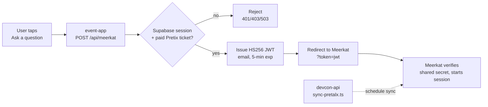

# Meerkat Integration

Attendees can view questions for a given session. We don't host the Q&A UI; we
authenticate the user on our side and hand them off to Meerkat - on the app side, we only show a preview of the current questions.

When a user taps "Ask a question" on a selected session, `POST /api/meerkat` gates on two checks — a valid Supabase session and
ownership of a paid Pretix ticket — then issues an HS256 JWT (`{ email, iat, exp }`, 5-min
expiry) signed with a secret shared with Meerkat. The browser is redirected to Meerkat with
`?token=<jwt>`; Meerkat verifies the signature independently and takes over.

Separately, **devcon-api** keeps Meerkat's session list in sync with the schedule via
`sync-pretalx.ts`, which POSTs schedule changes to Meerkat authenticated with a webhook
secret. Key secrets: `VERIFICATION_SECRET` (JWT signing, must match Meerkat's) and
`WEBHOOK_MEERKAT_SECRET` (sync webhook).



## Reading questions (public API)

`@meerkat-events/react` (an event-app dependency) is the read side. It hits:

```
GET {apiUrl}/api/v1/events/{sessionId}/questions?sort=newest|popular
GET {apiUrl}/api/v1/events/{sessionId}/questions/stream    # SSE, live updates
```

`apiUrl` defaults to `https://app.meerkat.events` and event-app doesn't override
it (`MeerkatProvider` is used with no props). Despite the `events/` path segment,
`sessionId` is a *session* code, i.e. the Pretalx code we store as `sourceId`.

Response shape: `{ id, sessionId, votes, question, createdAt, answeredAt?,
selectedAt?, user? }`.

**No credentials are involved.** The library sends only `Accept:
application/json`, so reading questions needs no token, and neither
`VERIFICATION_SECRET` (handover JWT) nor `WEBHOOK_MEERKAT_SECRET` (schedule sync)
applies to it. Those two are write/auth paths only.

## Devcon 7 (SEA): link-out only, no data came back

Worth knowing before anyone assumes SEA Q&A is recoverable from our side: it
never touched our systems. devcon-app rendered a "Join Live Q&A" tile linking
straight out, with no token exchange and no questions read back:

```
https://meerkat.events/e/{session.sourceId}/remote?secret={secret}
```

(`devcon-app/src/components/domain/app/dc7/sessions/index.tsx`, in
`Integrations`. `secret` was just forwarded from devcon-app's own query string
when present.)

So all SEA Q&A content lives on Meerkat's side. We hold the session codes
(`devcon-api/data/sessions/devcon-7/*.json`, 650 sessions) and nothing else.

## Service status (checked 2026-09-01)

Attempts to read DC7 questions failed. Both findings are about Meerkat's hosting,
not our integration:

- **`app.meerkat.events` returns HTTP 503**, after ~41s. DNS resolves (Fly.io)
  and TCP/443 accepts connections, so the edge is up but the app behind it isn't
  starting. The root path 503s too, so this isn't an auth rejection. Retried
  after a warm-up; unchanged.
- **`meerkat.events` is now a Framer marketing site.** The apex 308-redirects to
  `www.meerkat.events`, where the old DC7 links (`/e/{code}/remote`) 404. Every
  "Join Live Q&A" link in the shipped SEA app is therefore dead.

Read as a pair (domain moved to marketing, app backend unhealthy), this looks
like a service winding down rather than a transient outage — but that's an
inference, not something we confirmed with the Meerkat team.

If DC7 Q&A is wanted as an archive, the blocking step is asking Meerkat whether
the data still exists. If it does, scraping it is a short script: iterate the 650
`sourceId`s against the questions endpoint. Don't build that against a 503 first.

## Known gap: DC8 schedule sync

`sync-pretalx.ts` POSTs to a URL hardcoded to `devcon-7`
(`.../api/v1/sync/devcon/devcon-7`) and is gated to that event, so Devcon 8
schedule publishes never notify Meerkat and its session list goes stale. Tracked
as #11 in `docs/av/av-stack-overview.md`; needs an event-parameterised endpoint
agreed with the Meerkat team. Given the service status above, worth resolving
whether Meerkat is still in the plan for DC8 before spending effort on it.
