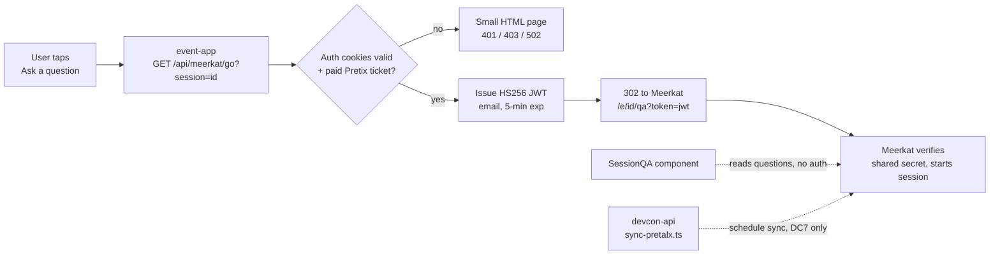

# Meerkat Integration

Live Q&A for sessions runs on Meerkat; the event-app shows the questions and hands
attendees over to Meerkat to ask one. Working end to end since 2026-09-14 on the
Devcon 7 test data (Meerkat set up the `opening-ceremony` session on their side).

- Read side: `event-app/src/components/schedule/SessionQA.tsx`, one component for the
  mobile session page, the expanded desktop view and the desktop side panel.
- Ask side: `event-app/src/app/api/meerkat/go/route.ts`, a cookie-authenticated redirect.
  JWT details for the Meerkat team: `event-app/src/app/api/meerkat/README.md`.
- Schedule sync (devcon-api): `devcon-api/src/scripts/sync-pretalx.ts`, see the known gap
  at the end.



## Reading questions

`@meerkat-events/react` is the read side, against Meerkat's public API:

```
GET {apiUrl}/api/v1/events/{sessionId}/questions?sort=newest|popular
GET {apiUrl}/api/v1/events/{sessionId}/questions/stream    # SSE, live updates
```

`apiUrl` defaults to `https://app.meerkat.events` and the app doesn't override it
(`MeerkatProvider` with no props). No credentials are involved; neither secret below
applies to reads.

How the component behaves:

- Sorted by popularity. Each question shows its vote count, the author's Meerkat name,
  a relative time, and a state tag: "Being answered" from `selectedAt`, "Answered" from
  `answeredAt`.
- A 404 from the questions endpoint means Meerkat has no Q&A for that session yet: the
  card says so and hides the ask link (Meerkat would 404 on the hand-off too). Other
  errors show a Retry.
- Realtime (SSE) is on since 2026-09-17, pending the Meerkat team's OK on the load: every
  open session view holds one stream (at most one per session per device). A small green
  dot next to "Powered by Meerkat" shows while the stream is connected. The list also
  refreshes when the tab regains focus, the fallback if the stream drops.
- Offline the block renders the usual "needs a connection" line.
- `?mockQa=1` renders placeholder questions in every state, for layout work on any
  session.

## Asking a question

"Ask a question" is a plain link to `GET /api/meerkat/go?session=<id>`, opened in a new
tab in browsers and in place in the installed app (a new tab from a home-screen app
doesn't carry the app's cookies on iOS, and the OS shows the out-of-scope page in an
in-app browser anyway). The route:

1. Reads the Supabase auth cookies the app mirrors through `/api/auth/session`,
   refreshing them when expired.
2. Checks for a paid Pretix ticket for the event, matched by email or attached by QR
   proof (the same rule as the ticket tab). Rate limited per user only; attendees at the
   venue share NAT addresses, and anonymous requests never reach Pretix.
3. Mints the HS256 JWT (`{ email, iat, exp }`, 5-minute expiry, timestamps in
   milliseconds) with the verified session email and answers a 302 to
   `https://app.meerkat.events/e/<sessionId>/qa?token=<jwt>` with `Cache-Control:
   no-store`.

Failures (not signed in, no ticket, ticket service down, malformed id) render a small
HTML page in that tab, since the request is a navigation, not a fetch. The redirect
replaced an earlier `POST /api/meerkat` that returned the token to the client: doing the
work behind a redirect keeps the click synchronous (Safari blocks `window.open` after an
awaited fetch) and keeps the token out of client code and the DOM.

## Session ids

The app passes its own schedule session id (the slug, e.g. `opening-ceremony`), not the
Pretalx code kept in `sourceId`. Meerkat's DC7 test session is keyed the same way. The
schedule sync must send ids Meerkat can match against these; confirm with the Meerkat
team when the sync is extended to Devcon 8.

## Secrets and go-live checklist

- `VERIFICATION_SECRET` (event-app, Netlify): signs the hand-off JWT and must equal the
  value Meerkat verifies with. **Not set in production yet.** The code falls back to a
  placeholder that lives in this public repo, so anyone can mint a token for any email
  until it is rotated. Before launch: generate a random secret, set it on the event-app
  site, share it with the Meerkat team through 1Password, and switch both sides together.
  Worth removing the fallback so the route fails closed when the variable is missing.
- `WEBHOOK_MEERKAT_SECRET` (devcon-api): bearer token for the schedule sync ping.
- Confirm realtime with the Meerkat team (one SSE connection per open session view); it is
  currently on in `SessionQA.tsx` for testing.

## Devcon 7 (SEA): link-out only

DC7 Q&A never touched our systems. devcon-app rendered a "Join Live Q&A" tile linking
straight to `https://meerkat.events/e/{session.sourceId}/remote?secret={secret}`, with
no token exchange and no questions read back. All SEA Q&A content lives on Meerkat's
side; we hold the session codes (`devcon-api/data/sessions/devcon-7/*.json`) and nothing
else. The apex `meerkat.events` is now a marketing site, so those old links 404.

## Service status

Checked 2026-09-01: `app.meerkat.events` answered 503 and the DC7 links were dead, which
read like a service winding down. Superseded: since 2026-09-12 the app is up again, the
questions API answers for the DC7 test session, and the Meerkat team has implemented
the JWT hand-over on their side. If DC7 Q&A is ever wanted as an archive, ask the
Meerkat team whether the data still exists before scripting anything.

## Known gap: DC8 schedule sync

`sync-pretalx.ts` POSTs to a URL hardcoded to `devcon-7`
(`.../api/v1/sync/devcon/devcon-7`) and is gated to that event, so Devcon 8 schedule
publishes never notify Meerkat and its session list goes stale. Tracked as #11 in
`docs/av/av-stack-overview.md`; needs an event-parameterised endpoint agreed with the
Meerkat team, using the session ids described above.
