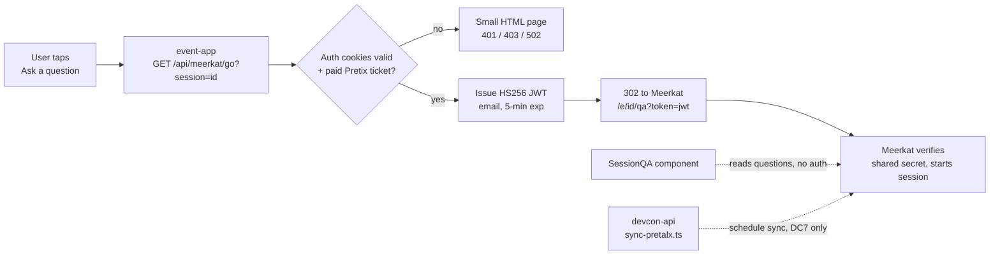

# Meerkat Integration

Live Q&A for sessions runs on Meerkat; the event-app shows the questions and hands
attendees over to Meerkat to ask one. Working end to end since 2026-09-14 on the
Devcon 7 test data (Meerkat set up the `opening-ceremony` session on their side).

- Read side: `event-app/src/components/schedule/SessionQA.tsx`, one component for the
  mobile session page, the expanded desktop view and the desktop side panel.
- Ask side: `event-app/src/app/api/meerkat/go/route.ts`, a cookie-authenticated redirect.
  JWT details for the Meerkat team: `event-app/src/app/api/meerkat/README.md`.
- Schedule sync (devcon-api): `devcon-api/src/scripts/sync-pretalx.ts`, see the known gap
  at the end.



## Reading questions

`@meerkat-events/react` is the read side, against Meerkat's public API:

```
GET {apiUrl}/api/v1/events/{sessionId}/questions?sort=newest|popular
GET {apiUrl}/api/v1/events/{sessionId}/questions/stream    # SSE, live updates
```

`apiUrl` defaults to `https://app.meerkat.events` and the app doesn't override it
(`MeerkatProvider` with no props). No credentials are involved; neither secret below
applies to reads.

How the component behaves:

- Sorted by popularity. Each question shows its vote count, the author's Meerkat name,
  a relative time, and a state tag: "Being answered" from `selectedAt`, "Answered" from
  `answeredAt`.
- A 404 from the questions endpoint means Meerkat has no Q&A for that session yet: the
  card says so and hides the ask link (Meerkat would 404 on the hand-off too). Other
  errors show a Retry.
- Realtime (SSE) is on since 2026-09-17, pending the Meerkat team's OK on the load: every
  open session view holds one stream (at most one per session per device). A small green
  dot next to "Powered by Meerkat" shows while the stream is connected. The list also
  refreshes when the tab regains focus, the fallback if the stream drops.
- Offline the block renders the usual "needs a connection" line.
- `?mockQa=1` renders placeholder questions in every state, for layout work on any
  session.

## Asking a question

"Ask a question" is a plain link to `GET /api/meerkat/go?session=<id>`, opened in a new
tab in browsers and in place in the installed app (a new tab from a home-screen app
doesn't carry the app's cookies on iOS, and the OS shows the out-of-scope page in an
in-app browser anyway). The route:

1. Reads the Supabase auth cookies the app mirrors through `/api/auth/session`,
   refreshing them when expired.
2. Checks for a paid Pretix ticket for the event, matched by email or attached by QR
   proof (the same rule as the ticket tab). Rate limited per user only; attendees at the
   venue share NAT addresses, and anonymous requests never reach Pretix.
3. Mints the HS256 JWT (`{ email, iat, exp }`, 5-minute expiry, timestamps in
   milliseconds) with the verified session email and answers a 302 to
   `https://app.meerkat.events/e/<sessionId>/qa?token=<jwt>` with `Cache-Control:
   no-store`.

Failures (not signed in, no ticket, ticket service down, malformed id) render a small
HTML page in that tab, since the request is a navigation, not a fetch. The redirect
replaced an earlier `POST /api/meerkat` that returned the token to the client: doing the
work behind a redirect keeps the click synchronous (Safari blocks `window.open` after an
awaited fetch) and keeps the token out of client code and the DOM.

## Session ids

Meerkat keys its events by the **Pretalx code** (our `sourceId`, e.g. `X3JSYF`), the same
convention as Devcon 7 and what the Meerkat team syncs from Pretalx. Since 2026-09-17 the
app passes that code for the feed and the hand-off (`meerkatEventId()` in
`event-app/src/data/meerkat.ts`); the code travels in the offline bundle (`sourceId` in
devcon-api's `BUNDLE_SESSION_FIELDS`). A bundle cached before the field shipped falls back
to the schedule slug, which Meerkat answers with 404 (shown as "Q&A isn't open yet") until
the device's next schedule sync. The DC7 test session on Meerkat is still keyed by the
slug `opening-ceremony`; it needs a twin under `X3JSYF` for the app to find it.

## Displaying questions on stage screens and streams (AV)

Meerkat ships the display side; what is missing is data and operations.

- **Presenter view** for the stage screen: `https://app.meerkat.events/stage/<stage>` shows
  the live session's title and speaker, the top questions, the participant count, a QR
  code to join and floating reactions, and follows whichever session on that stage is
  marked live, so it can stay open all day. `?hide-qr-code=true` drops the QR.
  `/stage/<stage>/qa` redirects to the live session's Q&A page. (Meerkat README, "How do
  I link to the currently live session?")
- **Moderation** (`/moderation`, organizer role): moderators mark the session live, pick
  the question being answered and mark questions answered. Those picks drive the
  presenter view and the "Being answered" / "Answered" tags in the app.
- **Public API by stage**, no auth: `GET /api/v1/events?stage=<stage>` and
  `GET /api/v1/conferences/<id>/events/live`, plus the questions and stream endpoints
  above.

Options for the livestream:

1. The presenter view as a browser source in OBS or vMix per room. It is a full-screen
   layout, so it works as a picture-in-picture panel or a scene, not as a lower third.
2. An overlay route in the event-app (for example `/room-screens/<room>/qa`) rendering the
   selected question or the top three on a transparent background, from the public API
   and the SSE stream. The room screens already derive the live session per room from
   the schedule, so this would not depend on moderators pressing "live" in Meerkat.
   Not built yet.
3. The same strip on the venue room screens (`/room-screens/<room>`). Those screens already
   show a "See questions" QR code to the stage presenter view (`/stage/<room name>`, which
   follows the live session), only when Meerkat lists sessions for that stage.

Prerequisites either way:

1. Devcon 8 sessions in Meerkat with `stage` set to our room, `uid` set to our session
   slug. Created through Meerkat's admin API (`POST /api/v1/admin/events`, batch upsert
   keyed by `uid`, `x-api-key` header) or the schedule sync once it covers DC8 (known
   gap below).
2. Organizer accounts for the moderators, granted by the Meerkat team through their
   invitations table.
3. A moderator in each room during sessions, or nothing gets marked live or selected.

To raise with the Meerkat team: the `stage` field in the sync payload, organizer invites,
and whether the presenter view could get a transparent overlay mode, which would make the
stream side a pure browser-source setup.

## Secrets and go-live checklist

- `VERIFICATION_SECRET` (event-app, Netlify): signs the hand-off JWT and must equal the
  value Meerkat verifies with. **Not set in production yet.** The code falls back to a
  placeholder that lives in this public repo, so anyone can mint a token for any email
  until it is rotated. Before launch: generate a random secret, set it on the event-app
  site, share it with the Meerkat team through 1Password, and switch both sides together.
  Worth removing the fallback so the route fails closed when the variable is missing.
- `WEBHOOK_MEERKAT_SECRET` (devcon-api): bearer token for the schedule sync ping.
- Confirm realtime with the Meerkat team (one SSE connection per open session view); it is
  currently on in `SessionQA.tsx` for testing.

## Devcon 7 (SEA): link-out only

DC7 Q&A never touched our systems. devcon-app rendered a "Join Live Q&A" tile linking
straight to `https://meerkat.events/e/{session.sourceId}/remote?secret={secret}`, with
no token exchange and no questions read back. All SEA Q&A content lives on Meerkat's
side; we hold the session codes (`devcon-api/data/sessions/devcon-7/*.json`) and nothing
else. The apex `meerkat.events` is now a marketing site, so those old links 404.

## Service status

Checked 2026-09-01: `app.meerkat.events` answered 503 and the DC7 links were dead, which
read like a service winding down. Superseded: since 2026-09-12 the app is up again, the
questions API answers for the DC7 test session, and the Meerkat team has implemented
the JWT hand-over on their side. If DC7 Q&A is ever wanted as an archive, ask the
Meerkat team whether the data still exists before scripting anything.

## Known gap: DC8 schedule sync

`sync-pretalx.ts` POSTs to a URL hardcoded to `devcon-7`
(`.../api/v1/sync/devcon/devcon-7`) and is gated to that event, so Devcon 8 schedule
publishes never notify Meerkat and its session list goes stale. Tracked as #11 in
`docs/av/av-stack-overview.md`; needs an event-parameterised endpoint agreed with the
Meerkat team, using the session ids described above.
