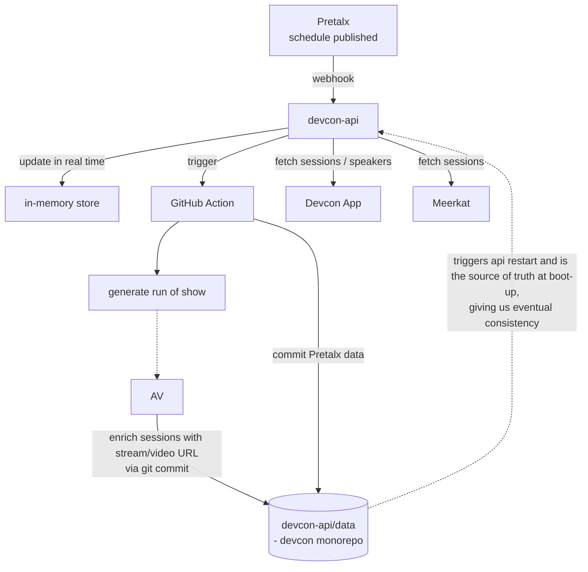

# Devcon AV Stack - Map & Devcon 8 Readiness Assessment

## Context

Ahead of Devcon 8 (Mumbai/India), we need a clear picture of everything AV-related in
`efdevcon/monorepo`: livestreams, video delivery, graphic generation, and the data
pipelines that feed the archive. The repo contains a handover document
(`../now.md`, AV section pointing to `pretalx-pipeline.md` alongside this doc) which
states the AV enrichment pipeline was never built because the AV team wasn't formed at
the time. This document maps what
actually exists, separates live from dormant, and lists what will break for DC8 if
untouched.

No implementation is proposed here - this is an assessment; decisions belong with the
AV team.

_Assessment date: 2026-08-04. Coverage counts, live-API observations and line
references are as of this date._

---

## 1. Architecture in one paragraph

There is **no database** and **no media infrastructure of Devcon's own**.

- **Hosting:** the API (`api.devcon.org`) runs on **Render**. Committing to
  `devcon-api/data/` redeploys it (Render boots the new instance in parallel, so no
  downtime), which is how git-committed changes reach the running API.
- **Data layer:** `devcon-api` has no Prisma/SQLite/Postgres. Synced data lives as plain
  JSON committed into `devcon-api/data/`, loaded into memory at boot by
  `devcon-api/src/data/store.ts:19-87`. Between deploys the data is **also updated on
  the fly**: the Pretalx webhook swaps the in-memory store in real time (`hooks.ts` →
  `store.ts:393-418`), and `PUT /sessions/sources/:id` writes to memory immediately -
  the git commit is for the next boot (eventual consistency - AV commits are even
  tagged `[skip deploy]`, `sessions.ts:130`, so they don't force a restart). Writes go
  back to **git** via `devcon-api/src/services/github.ts:4` (`CommitSession`). Git is
  the system of record.
- **Playback:** no player library exists anywhere (no react-player/video.js/hls.js/plyr/
  vidstack - verified against every `package.json`). No HLS, RTMP, DASH, WebRTC, Mux, or
  Cloudflare Stream. Everything is third-party iframes (YouTube, StreamEth,
  Etherna/Swarm, stm.live) plus one raw `<video>` in the archive's IPFS tab.
- **Ingestion:** Pretalx (`cfp.devcon.org`) is the source of truth for schedule; YouTube
  is the system of record for video. AV enrichment happens via
  `PUT /sessions/sources/:id`, which updates memory and commits to git.
- **Consumers of the API:** Devcon App (sessions/speakers/livestreams), the archive
  (`archive/`), devcon.org (`/dips`), devcon-ai (RAG embeddings built during sync), and
  **Meerkat** (session Q&A - fetches sessions from the API, and the sync script pings it
  on schedule changes; see §3 #11).

Consequence: "building the AV pipeline" is entirely a **data** problem. No encoding,
storage, or player work is implied.

## 2. The flow that exists today

High level (matches the internal architecture diagram, plus the consumers):



In detail:

```
Pretalx (cfp.devcon.org, schedule published)
  └─webhook──> POST /hooks/pretalx/:eventId/schedule   (devcon-api/src/controllers/hooks.ts)
                 ├─ in-memory atomic swap (store.ts:393-418, zero downtime)
                 └─ TriggerWorkflow() per WORKFLOW_MAP (hooks.ts:10-14)
                      ├─ sync-pretalx-<event>.yml ──> commits devcon-api/data/ ──> API restart
                      │                            ├─> devcon-ai `sync:sessions` (RAG embeddings)
                      │                            └─> POST meerkat.events sync ping (devcon-7 only, see §3 #11)
                      └─ run-of-show-<event>.yml  ──> rebuilds Google Sheet for AV team

AV / encoding vendor
  └─PUT /sessions/sources/:id (API key) ──> memory + CommitSession() to git
                                            fields: sources_{youtubeId,ipfsHash,swarmHash,
                                                    livepeerId,streamethId}, transcript_vtt,
                                                    transcript_text, duration
```

Details that matter:

- `WORKFLOW_MAP` wires **devcon8's and test-devcon-8's run-of-show to regenerate on
  every schedule publish**; devcon-7's does not (sync only).
- The webhook also accepts slug-less `POST /hooks/pretalx/schedule` and resolves the
  event from the Pretalx slug in the payload - **falling back to `devcon-7`** for an
  unknown slug (`hooks.ts:32`). A webhook from a new/renamed Pretalx event would
  silently resync devcon-7.
- Both sync workflows also have a **monthly cron fallback** (`0 23 30 * *`), so data
  refreshes even if no schedule is published.
- The devcon-7 sync additionally runs `createPresentations()` (Google Slides) and a
  glossary build - gated `if (eventId === 'devcon-7')` in `sync-pretalx.ts:26`.
- **Speaker emails never leave the sync**: each speaker gets
  `hash = HMAC-SHA256(EMAIL_SECRET, email)` (`pretalx.ts:270-271`) so downstream tools
  can match a signed-in email against confirmed speakers without the API exposing
  addresses. Two implications: rotating `EMAIL_SECRET` changes every speaker hash, and
  if the env var is missing the sync just **warns and skips hashing**
  (`pretalx.ts:46-47`) - no hard failure. No in-repo consumer today (the visa speaker
  form queries Pretalx directly), but treat the secret as stable.
- **AV write auth is a query-string API key**: `PUT /sessions/:id` and
  `PUT /sessions/sources/:id` check `?apiKey=` against `SERVER_CONFIG.API_KEYS` with a
  plain `includes()` (`src/middleware/apikey.ts`). Keys handed to AV vendors will land
  in URLs - and therefore in Render access logs and any proxy logs. Fine for now, but
  know it when issuing DC8 vendor keys (a header would be the low-effort upgrade).
- **Pretalx instance:** everything lives on `https://cfp.devcon.org` (migrated from
  `mum.speakat.xyz` in Aug 2026; `speak.devcon.org` retired before that). All
  `PRETALX_BASE_URI` entries in `devcon-api/src/utils/config.ts` now point there.
  Gotcha: a stale base URL is worse than a broken one - fetch **strips the
  `Authorization` header on the cross-origin 301 redirect**, so the sync runs
  anonymously and private events 401 while public ones keep working. The secret name
  `PRETALX_API_KEY_MUMBAI` predates the rename and is kept as-is.

## 2b. Automation inventory - every Pretalx/AV entry point

One table for everything that runs (or is supposed to run) without a human editing JSON
by hand. "Manual" means someone runs a pnpm script locally.

| Automation | What it does | Trigger | Event scoping | Status |
|---|---|---|---|---|
| Pretalx webhook (`hooks.ts`) | Full resync into memory + dispatches workflows | Pretalx "schedule published" plugin webhook | Slug-resolved, **defaults to devcon-7** | Live |
| `sync-pretalx{,-devcon8,-test-devcon-8}.yml` | Commits `devcon-api/data/` to git (→ Render redeploy), builds devcon-ai RAG embeddings, pings Meerkat | Webhook-dispatched + monthly cron (`0 23 30 * *`) | devcon-7 / devcon8 / test-devcon-8 | Live |
| `run-of-show-{devcon8,test-devcon-8}.yml` | Rebuilds the AV team's Google Sheet | Webhook-dispatched + manual dispatch | devcon8 / test-devcon-8 (devcon-7 not wired) | Live |
| Meerkat ping (`notifyClients()` in sync script) | POST sync ping to `meerkat.events` | Runs inside the sync script | **devcon-7 only, URL hardcoded** (§3 #11) | Live (DC7 only) |
| `pnpm yt` → `syncThumbnails()` | Renders `social-ticket /av/:id` at 1920×1080 and pushes via `youtube.thumbnails.set()` (105/run for quota) | Manual, interactive browser OAuth | `sessions/devcon-7` hardcoded | Manual |
| `pnpm yt` → `syncDescriptions()` | Rewrites YouTube **titles** (truncated to fit "by <speaker>" + a hardcoded `\| Devcon SEA` suffix into 100 chars) and **descriptions** (from session description + tags), ledger `youtube-descriptions.json` | **Commented out** in `main()` (`yt.ts:11-12`) | devcon-7 + SEA branding hardcoded | Disabled |
| `pnpm import:yt` | Imports YouTube playlists (`data/playlists.json`) into session JSONs - how devconnect-arg's 418 sessions got in | Manual, Google **service account** | `eventId = 'devconnect-arg'` hardcoded (`import-yt.ts:137`) | Manual |
| `pnpm stats:v` | AV source-coverage report | Manual | devcon-7 + Nov 2024 dates hardcoded (§3 #8) | Manual |
| social-ticket OG routes | On-demand edge-rendered cards (see §4) | HTTP, `devcon-social.netlify.app` | DC7 branding | Live |
| `generate-images.yml` (nested `.github`) | DC6 lower-thirds + social cards | Hourly cron in a nested `.github` GitHub never executes | DC6 | Dead (§8) |
| `pnpm slides` | Google Slides migration | Manual | `data/slides/` gone → throws | Dead (§9) |

## 2c. The app question: devcon-app (DC7) vs event-app (DC8 PWA)

The handover doc positions `event-app` as the new PWA going forward (offline-first:
Dexie + SWR, Serwist service worker, optional native iOS/Android via Capacitor - see
`documentation-by-folder/event-app/event-app.md`). This changes how the devcon-app
blockers should be read:

- **event-app has no AV surface at all.** No player, iframe, or `<video>` anywhere.
  More fundamentally, its zod models **strip the AV fields at validation**:
  `SessionSchema` has no `sources_*` fields and `RoomSchema` has no
  `youtubeStreamUrl_*` / `translationUrl` (`event-app/src/data/models/{sessions,rooms}.ts`).
  Even with devcon-api fully populated, no stream URL can reach a component today. If
  DC8 ships on event-app, blocker #3's devcon-app fix is moot - but the entire
  livestream/recording UI has to be **built**, schemas first.
- **Data source:** the active provider is `DevconApiProvider` → devcon-api, with a
  runtime-switchable dataset (`?dataset`) offering `test-devcon-8`, `devcon8` and
  `devcon-7` (`event-app/src/data/dataset.ts`). A second, currently **inactive**
  provider (`devcon.provider.ts`) reads Pretalx directly through
  `/api/pretalx` - a server-side proxy hardcoded to `EVENT_SLUG = 'test-devcon-8'`
  (`event-app/src/app/api/pretalx/route.ts:4`); flip that slug if the provider is ever
  reactivated.
- **Room screens (venue signage) live here now:** `/room-screens/[id]` renders a
  per-room now/next display with a QR code into the app. The "Resources / Livestreams"
  box is **text-only** ("if the room is full, please watch on livestream") - no stream
  embed, consistent with the schema gap above. devcon-app has the DC7 predecessor at
  `devcon-app/src/pages/room-screens/[id].tsx` (also no stream embed).
- **Meerkat's user-facing half** is in event-app: `POST /api/meerkat` gates on a
  Supabase session + paid Pretix ticket, then hands off with a 5-min HS256 JWT
  (secret shared with Meerkat). The schedule-sync half is §3 #11.
- event-app's `/api/admin/{datasets,search,inference}` routes are the debugging UI for
  the devcon-ai RAG stack (per the handover doc).
- devcon-app meanwhile shows a dismissable "Devcon 8 prep" banner (`_app.tsx:33`) but
  is otherwise still fully DC7-wired.

## 3. Devcon 8 blockers - independent hardcodes that fail silently

Ranked by severity. Each is a separate fix.

| # | Issue | Location | Effect |
|---|---|---|---|
| 1 | `updateEventVersion('devcon-7')` hardcoded in the AV ingestion endpoint | `devcon-api/src/controllers/sessions.ts:126` | Every DC8 video `PUT` bumps **DC7's** cache-bust token. DC8 clients never see new videos. |
| 2 | `devcon8` rooms have no `youtubeStreamUrl_*` / `translationUrl` fields | `devcon-api/data/rooms/devcon8/*.json` | All DC8 sessions render "No livestream available". |
| 3 | Day→stream mapping hardcoded to Bangkok + Nov 12–15 2024 | `devcon-app/src/components/domain/app/dc7/sessions/index.tsx:1646-1653` (`.add(7,'hours')`, `day == 12..15`) | Even with URLs populated, DC8 dates/timezone fall through to no-stream. Only applies if DC8 ships on devcon-app - if it ships on event-app the fix is moot, but a bigger one replaces it: event-app has **no AV surface at all** (§2c). |
| 4 | `PRETALX_QUESTIONS_*` IDs unmapped for `devcon8` / `test-devcon-8` | `devcon-api/src/utils/config.ts:94-147` | Speaker socials, expertise, audience, tags, keywords all silently empty. |
| 5 | `submission_type` numeric IDs hardcoded to DC7's | `devcon-api/src/clients/pretalx.ts:280-286` | DC8 sessions fall through to the **raw Pretalx type name** (`submission_type.name.en`, `pretalx.ts:199-202`), `'Talk'` only as last resort. Labels won't match the app's canonical set (`Talk`/`Lightning Talk`/`Workshop`/`Panel`/`Music`), so type filters break; keynote-IDs→`Talk` normalisation is lost. |
| 6 | `social-ticket` is entirely DC7 Bangkok-branded | `social-ticket/public/dc7/`, track artwork | It is the **YouTube thumbnail generator** (see §4). DC8 uploads would get DC7 branding. |
| 7 | Run-of-show renders times in **UTC** | `devcon-api/src/scripts/generate-run-of-show.ts:224-228` (`d.utc().format('HH:mm')`) | Wrong wall-clock for stage crew (IST is UTC+5:30). |
| 8 | `stats-video.ts` hardcoded to devcon-7 + Nov dates | `devcon-api/src/scripts/stats-video.ts:6,19-25` | The only AV coverage report can't be run for DC8. |
| 9 | `yt.ts` uses `@google-cloud/local-auth` (interactive browser OAuth) | `devcon-api/src/clients/google.ts:42` | Cannot run in CI; YouTube push is manual-only. Nuance: a service-account path exists (`AuthenticateServiceAccount`, used by `import-yt.ts`) but service accounts can only *read* YouTube - writes (thumbnails/titles) need the channel owner's OAuth, so CI would require a stored refresh token. |
| 10 | Workflow dispatch + git commits authenticated with a former maintainer's **personal access token** | `devcon-api/src/services/github.ts:96` (`TriggerWorkflow`) and `CommitSession`, via `GITHUB_TOKEN` in the API's Render env (the workflow files themselves use the repo-scoped `secrets.GITHUB_TOKEN`, which is fine) | Webhook→workflow triggering and AV session commits die when the account is deprovisioned. `PRETALX_API_KEY(_MUMBAI)` repo secrets need an owner too. |
| 11 | Meerkat schedule sync ping gated to devcon-7 **and** hardcoded to `meerkat.events/api/v1/sync/devcon/devcon-7` | `devcon-api/src/scripts/sync-pretalx.ts:17-18,38` | DC8 schedule publishes never notify Meerkat (session Q&A), so its session list goes stale. Needs an event-parameterised endpoint agreed with the Meerkat team (see `documentation-by-folder/__current-tasks/meerkat/meerkat.md`). |
| 12 | `devcon8` event metadata is empty - the file holds only `rooms` + `version`, where devcon-7 has `title`, `edition`, `description`, `startDate`/`endDate`, `location`, `venue_*` | `devcon-api/data/events/devcon8.json` | The API serves a nameless, dateless DC8 event. Nothing fills it: `syncEventData()` only bumps `version` (`sync-pretalx.ts`) - event metadata is **hand-authored**, so someone must write it. Apps that key off event dates (day indexing, "day 1..4" labels) have nothing to derive from. |

## 4. The non-obvious dependency: `social-ticket` is the YouTube thumbnail generator

`devcon-api/src/scripts/yt.ts:86-90` fetches `social-ticket`'s `/av/{id}/opengraph-image`
at 1920×1080 and pushes it straight to `youtube.thumbnails.set()`. That route is not an
OG endpoint - it is the video thumbnail renderer for the archive. Idempotency ledger:
`devcon-api/src/scripts/youtube-thumbnails.json` (581 IDs), throttled `.slice(0, 105)`
per run for YT quota.

`social-ticket` is also still the live OG source for `devcon-app/src/pages/schedule/*`
and `devcon/src/components/domain/index/hero/Hero.tsx`, so it is serving stale
DC7-branded cards today.

The full route inventory (all are Next.js `next/og`/satori edge renderers on
`devcon-social.netlify.app`, fetching session data from devcon-api `/sessions/:id` via
the `API_URL` env - which **defaults to `http://localhost:4000`**, so the Netlify env
var is load-bearing):

| Route | Size | Consumed by |
|---|---|---|
| `/av/[id]/opengraph-image` | 1920×1080 | `yt.ts` → YouTube thumbnails; archive video OG |
| `/schedule/[id]/opengraph-image` | 1200×630 | `devcon-app/src/pages/schedule/[id].tsx:113` session share cards |
| `/schedule/u/[id]/opengraph-image` | 1200×630 | `devcon-app/src/pages/schedule/u/[id].tsx:56` personal-schedule share cards |
| `/[name]/opengraph-image` | ticket | The original DC7 attendee "social ticket" |

Cross-link with blocker #1: devcon-app cache-busts the schedule OG URL with
`?v=${useEventVersion()}` - the very version token that `PUT /sessions/sources/:id`
bumps for the wrong event. So the `'devcon-7'` hardcode doesn't just hide new videos;
it also keeps DC8's share cards pinned to stale cached renders.

`yt.ts` also contains a currently-disabled **YouTube title + description rewriter**
(`syncDescriptions()`, commented out in `main()`): it retitles videos to fit
`<title> by <speaker> | Devcon SEA` into YouTube's 100-char limit and regenerates
descriptions from session data (ledger: `youtube-descriptions.json`, 578 IDs). If
revived for DC8: the `' | Devcon SEA'` suffix (`yt.ts:28`), the `sessions/devcon-7`
source (`yt.ts:20,77`), and the description boilerplate ("Devcon SEA was held in
Bangkok… Nov 12 - Nov 15, 2024", `yt.ts:121`) are all hardcoded.

Historic duplicate: `devcon-api/src/controllers/sessions.ts:139-225`
(`GET /sessions/:id/image`) launches **Puppeteer** to screenshot a Handlebars template,
and has an unreachable 1920×1080 `'video'` branch (`imageType` hardcoded `'og'` at :145)
- someone intended it to do exactly what `social-ticket/av` now does. `puppeteer` pinned
at `18.2.1`, DC6-era track names. Dead.

## 5. Destructive-behaviour risks (live footguns)

1. **Run-of-show destroys AV team's manual work.** `applyFormatting()` unmerges and
   rewrites all formatting, and tabs are destructively rebuilt every run
   (`generate-run-of-show.ts:118-135`). Columns `MODERATOR`, `SLIDES / MEDIA`,
   `MIC CONFIG`, `INTERNAL NOTES`, `PUBLIC NOTES` are intentionally blank for AV to fill
   - and for **devcon8 this regenerates automatically on every Pretalx publish**. The
   handover doc flags this as unresolved. Options: make the sheet immutable and document
   it, or split generated vs. hand-edited columns onto separate tabs.
2. **Sync can delete committed data.** `sync-pretalx.ts:99-103,147-152` `unlinkSync`s any
   local room/session file whose id is absent from the Pretalx response. A partial API
   response deletes real data. Partly mitigated by `concurrency: cancel-in-progress:
   false` and `pull --rebase --autostash -X theirs`.
3. **Livestream config survives only by spread order.** Room stream URLs persist across
   sync purely because of `{...roomFs, ...room}` at `sync-pretalx.ts:105-118` (Pretalx
   never returns those keys). Reversing that spread silently wipes livestream config.

## 6. Source coverage on disk

| Event | Sessions | YouTube | IPFS | Swarm | StreamEth | Livepeer | Transcript |
|---|---|---|---|---|---|---|---|
| devcon-0 … 6 | 1,079 | ~all | ~all | ~all | – | – | – |
| **devcon-7** | 650 | 580 | **0** | 555 | 388 | **1** | 367 |
| **devconnect-arg** | 418 | 418 | 0 | 0 | 0 | 0 | 0 |
| **devcon8** | 3 | 0 | 0 | 0 | 0 | 0 | 0 |

- IPFS mirroring **stopped after DC6**, and the gateway in use
  (`cloudflare-ipfs.com`, `archive/src/components/domain/archive/Video.tsx:188`) is
  **decommissioned** - so the IPFS tab is broken even for the videos that have hashes.
- Swarm is the surviving decentralized mirror (555/650 for DC7), but the archive's Swarm
  player tab is **commented out** - only reachable in devcon-app.
- Livepeer is 1 session. `STREAMING_URL = 'https://live.devcon.org/'` still exported from
  `devcon/src/utils/constants.ts:7` and `devcon-app/src/utils/constants.ts:5` with zero
  consumers.

## 7. Confirmed bugs (independent of DC8)

1. **Slides never render for any session.** `archive/.../Video.tsx:267,276,279` reads
   `video.slidesUrl`; the API serves `resources_slides`. `slidesUrl` appears in **zero**
   of 2,155 session JSON files. 527 DC7 + 287 DC6 sessions have slides that are
   invisible. `archive/src/types/index.ts:25-31` is entirely Gatsby-era naming.
2. **Related videos always empty.** `devcon-api/src/data/store.ts:79-87` intentionally
   skips vectorization with the comment *"no client uses it"* - but
   `archive/src/services/devcon.ts:120` does call `/sessions/:id/related`. The comment is
   wrong; the archive silently gets nothing. The working replacement is
   `devcon-ai/src/routes/recommend.ts`.
3. **Player switcher hidden.** `devcon-app/.../sessions/index.tsx:1672` gates the source
   pills on `sources_swarmHash`, so YouTube+StreamEth sessions offer no choice.
4. **New events invisible in archive search** until
   `archive/src/hooks/useArchiveSearch.ts:14` is hand-edited (hardcoded event list).
5. **Archive playlists are dead code.** `archive/src/services/playlists.ts` + 24 JSON
   files are never imported by any route, and use the old Gatsby path scheme.
   `Video.tsx` renders a `playlists` prop the page never passes.
6. **Production `/events` publicly serves three phantom events** (live-verified
   2026-08-04): `0` (stray `data/events/0.json`, an artifact of `import-yt.ts:77`
   `ensureEventFile()`), `devcon-mumbai-playground` (test instance, removed from
   `PRETALX_INSTANCES` but its data files remain), and `test-devcon-8`. `initStore`
   loads every file in `data/events/` - there is no draft/hidden flag. The archive is
   only shielded by its own hardcoded event list (§7.4).

## 8. Buried assets nobody reads

- **1,092 whisper.cpp transcripts** in `devcon-api/data/transcripts/devcon-{0..6}/`
  (`ggml-base.en`, full timestamp arrays). **Zero readers** - no import, route, or build
  step touches that directory.
- **~280 MB of DC7 per-room live-caption CSVs** in
  `devcon-api/data/transcripts/devcon-7/` - `transcriptions-<room>.csv`, one per stage,
  with `Recognition` plus **10 translation columns** (`bn-IN, fil-PH, hi-IN, id-ID,
  km-KH, ms-MY, my-MM, th-TH, vi-VN, zh-CN`). Raw AV-booth output. Nothing joins them
  back to sessions by `slot_start`/`slot_end`. `breakout-1`/`breakout-2` are header-only
  (127 bytes - nothing captured).
- **`transcript_vtt` is never parsed.** No `.vtt` parser, no `<track>` element, no caption
  rendering anywhere in the monorepo. Some values are the literal string
  `"No VTT link provided"`. Only `transcript_text` is used, and only for LLM consumption.
- **Transcripts are not in the current RAG index.** `devcon-ai/scripts/sync-sessions.ts`
  builds embeddings from title/speakers/tags/description only; it does carry
  `youtube_id` in metadata (`:196`). The DC7 transcript corpus is reachable only via the
  older `devcon-api` OpenAI Assistants vector store.
- **`devcon-api/generated/`** - 1,466 committed files (`_youtube.txt` ×413,
  `_1080.png` ×517, `_social.png` ×519) of DC6 lower-thirds and social cards, produced by
  `devcon-api/.github/workflows/generate-images.yml` (hourly cron, Node 14) running
  `yarn scripts:generator` - **a script that exists in no `package.json`**, in a nested
  `.github` GitHub never executes. Fully broken; artifacts stale.
- `devcon-api/data/audio/devcon-6/` - 7 mp3s (DC6 opening ceremonies) powering
  `GET /rss/podcast`. Abandoned experiment.
- `devcon-api/data/edge-cases.json` - hand-maintained notes on YouTube playlists that
  `import:yt` couldn't ingest (channel pages instead of playlists, etc.). Zero code
  readers; useful context if the devconnect-arg import is ever re-run.

## 9. Dormant / dead inventory (safe-to-delete candidates)

- `devcon-api/src/scripts/encrypt.ts` - not in `package.json`, `data/accounts/` gone.
- `devcon-api/src/services/email.ts` - nodemailer SMTP sender with three templates
  (incl. `accreditation-confirmation`); **zero importers** in `src/`. Leftover from the
  removed account system.
- `devcon-api/src/utils/{profile,zupass,web3}.ts` - zero importers each; more
  account-system remnants (`utils/account.ts` by contrast is live, used by the Pretalx
  and DIPs clients).
- `devcon-api/src/scripts/slides.ts` - `data/slides/` doesn't exist, so `migrateSlides()`
  throws; `exportSlides()` commented out at `:8`.
- `devcon-api/src/clients/recommendation.ts` + `data/vectors/` - deliberately disabled.
- `devcon-api/src/types/schedule.ts:22-45` - Prisma-shaped `{connect:{id}}` payloads,
  fossilized; live replacement is `pretalxToStoreData()` in `hooks.ts:50`.
- `devcon-api/src/services/at-slurper/main.ts` - hardcoded mock events + Notion DB id,
  and it **runs on API boot** (imported for side effects at
  `controllers/at-slurper.ts:4`).
- `atproto-slurper/slurper/server.ts` - firehose call commented out in both branches;
  hardcoded cursor override in millis where Jetstream expects microseconds;
  `backfillData()` fully commented out. Only the HTTP endpoints are live.
- `devcon-ai/src/routes/generate-image.ts` + `base-model.ts` - `readFileSync` reference
  PNGs (`mumbai-character.png`, `base-model.png`, `dc8-bg.png`) that **don't exist** →
  ENOENT on any request. `generate-image.ts` is the sole consumer of
  `@imgly/background-removal-node`.
- `devcon-ai/src/lib/replicate.ts` - zero importers, `AVATAR_PROVIDER` referenced
  nowhere, `replicate` not in `package.json`.
- Workflows: `run-of-show-devcon-mumbai-playground.yml` and
  `sync-pretalx-devcon-mumbai-playground.yml` (scripts don't exist; instance removed from
  `PRETALX_INSTANCES`), `devcon-archive.yml` (targets `./devcon-archive`, dir is
  `archive/`), `ai-content-prep.yml` (`on: push` commented out, `yarn` in a pnpm repo),
  `devcon-db-cleanup.yml` (no DB any more).
- `devcon-app/src/pages/streams.tsx` - ops stream wall, gated on `youtubeStreamUrl_4`
  (DC7 day 4).
- `devconnect-app` stages pages - replaced by stubs linking to
  `devconnect.org/#videos`; real code sits in `page_backup.tsx` with ~20 commented-out
  YouTube URLs from live hand-editing.

## 10. Suggested sequencing (for discussion with the AV team)

**Before DC8 content exists** - unblock the pipeline:
1. Fix the `'devcon-7'` hardcode in `sessions.ts:126` (blocker #1). Highest severity,
   smallest diff.
2. Map `PRETALX_QUESTIONS_*` and `submission_type` IDs for `devcon8` (#4, #5).
3. Rotate `GITHUB_TOKEN` (Render) off the former maintainer's account; reconfirm ownership of the
   `PRETALX_API_KEY(_MUMBAI)` secrets against cfp.devcon.org (#10).
4. Decide run-of-show mutability policy before the DC8 CFP schedule publishes (§5.1) -
   this is a process decision, not a code one.
5. Agree an event-parameterised sync endpoint with the Meerkat team and un-gate
   `notifyClients()` (#11).

**Before DC8 doors open** - livestream surface:
6. **Decide which app carries DC8's AV surface** (§2c). If devcon-app: fix the
   day-of-month/timezone hardcode (#3). If event-app: extend the zod schemas with
   `sources_*` / room stream fields and build the livestream + recording UI from
   scratch. This decision gates everything below.
7. Hand-author `devcon8` event metadata (title, dates, venue - #12) and populate room
   stream fields (#2).
8. Re-brand or replace `social-ticket` for DC8, since it feeds YouTube thumbnails (#6).
9. Fix run-of-show UTC → event-local time (#7).
10. Generalise `stats-video.ts` to take an event id (#8).

**Independent of DC8** - cheap credibility wins:
11. `slidesUrl` → `resources_slides` (§7.1). One-line fix, unlocks 814 sessions' slides.
12. Either build the `/related` vectors or point the archive at
    `devcon-ai/recommend` (§7.2).
13. Swap the dead `cloudflare-ipfs.com` gateway (§6).

## Verification

No code changes are proposed in this document. To validate the findings above:

- Coverage counts: `cd monorepo/devcon-api && pnpm stats:v` (devcon-7 only - see #8).
- Room stream fields: inspect `devcon-api/data/rooms/devcon8/*.json` vs
  `devcon-api/data/rooms/devcon-7/main-stage.json`.
- Broken slides field: `grep -rl 'slidesUrl' monorepo/devcon-api/data/sessions/` returns
  nothing; `grep -rl 'resources_slides'` returns 814 files.
- Dormant recommender: `curl https://api.devcon.org/sessions/<id>/related` → 404.
- Thumbnail dependency: `curl -I https://devcon-social.netlify.app/av/<sourceId>/opengraph-image`.
- Pipeline liveness: `git log --oneline --author=github-actions -5` shows
  `[action] Pretalx Sync` commits.
- Sync auth against cfp.devcon.org: run `pnpm sync:pretalx:devcon8` locally - a stale
  base URL / key shows as public endpoints 200 but private events 401 (the redirect
  strips the `Authorization` header, so the failure is silent).
- Meerkat gating: `grep -n "meerkat" devcon-api/src/scripts/sync-pretalx.ts` - note the
  `devcon-7`-only guard and hardcoded URL (#11).
