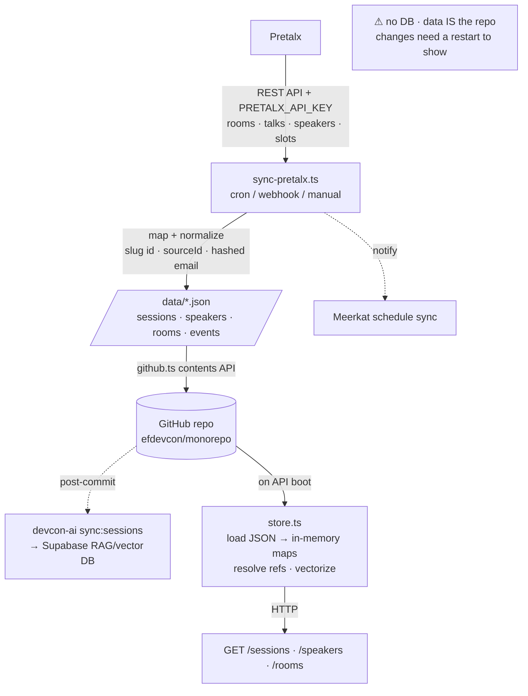

# Pretalx → devcon-api → repo (schedule data pipeline)

Pretalx is the source of truth for talks, speakers, rooms and the
schedule. devcon-api has **no database** — instead the synced data lives as plain JSON files
committed into the repo (`devcon-api/data/`), and the running API loads those files into memory
at startup (and also gets updated on the fly via webhook when pretalx changes).

Rough flow: Pretalx new schedule published → webhook plugin calls our hook listener on api.render.com -> API syncs the schedule into memory, and sync script puts JSON files in git (so its ready on next start up and we can trail the changes)

The sync script is `devcon-api/src/scripts/sync-pretalx.ts` (currently configured for devcon-7 and devcon-mumbai-playground, just fyi, would need to swap this to point to the production event at some point).

Note that speakers are not keyed by speaker email (hashed with a salt) so we don't leak speaker emails

More context in /documentation-by-folder/\_actions

# Testing the data flow

The pretalx instance runs at "https://mum.speakat.xyz"

The production/real event is not hooked up - I have been testing with "devcon-mumbai-playground", so that is also what is connected to github actions and so forth on a new schedule publish. You can swap this for the production instance at a later time.

Data _only ever updates_ when a new schedule is published. There's an installed plugin on our pretalx instance which fires a webhook whenever a new schedule is published - it fires to the api running on render - I'd do a quick publish test and check the logs to see it in action.

What happens in the webhook handler: The devcon api loads new schedule into memory (for real-time update) and then triggers the github action, which commits the changes locally to the repo.

# notes on archive <> api

Archive pulls from the devcon api, which basically just loads all the files in the data folder - if you want to add videos to the archive, simply add the entries yourself (that's how I added devconnect arg videos earlier in the year) - we had a database before, I removed that entirely, so the setup is pretty simple if you ever need to adjust it

For actually getting the video urls as sessions are streamed, you'd need to build an AV pipeline to commit into the repo directly - basically you need to receive sessions coming from _wherever the sessions are streamed_ and enrich the sessions in the repo - I think it was done by pablo and co. via github prs last time, maybe it can be done differently, didn't get to play with it yet because the AV team wasn't formed - I'd work with Carlota and James for this.

