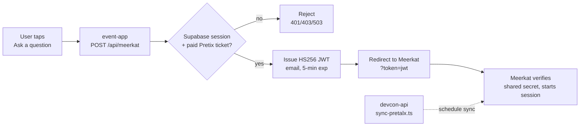

# Meerkat Integration

Attendees can view questions for a given session. We don't host the Q&A UI; we
authenticate the user on our side and hand them off to Meerkat - on the app side, we only show a preview of the current questions.

When a user taps "Ask a question" on a selected session, `POST /api/meerkat` gates on two checks — a valid Supabase session and
ownership of a paid Pretix ticket — then issues an HS256 JWT (`{ email, iat, exp }`, 5-min
expiry) signed with a secret shared with Meerkat. The browser is redirected to Meerkat with
`?token=<jwt>`; Meerkat verifies the signature independently and takes over.

Separately, **devcon-api** keeps Meerkat's session list in sync with the schedule via
`sync-pretalx.ts`, which POSTs schedule changes to Meerkat authenticated with a webhook
secret. Key secrets: `VERIFICATION_SECRET` (JWT signing, must match Meerkat's) and
`WEBHOOK_MEERKAT_SECRET` (sync webhook).

