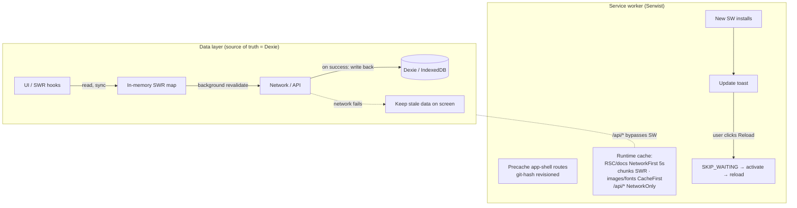

# Service worker / pwa setup

The service worker is built with **`@serwist/next`** (`src/sw.ts`, compiled to `public/sw.js`).
Precaching is deliberately light — only the **app-shell routes** (`/`, `/schedule`, `/speakers`,
`/map`, `/profile`, `/login`, `/offline`), revisioned by git commit hash so a new deploy busts the
shell. Keep in mind when testing the production build locally as this will currently look like no changes happens between edits.

The precache is light on purpose because if you try to make the whole app function offline on first install, you'd have to precache every single session and speaker, which delays the time-to-update and time-to-install significantly (we had this problem in Devcon Bogota, iirc its a workbox issue that may or may not have been resolved in the meantime, but basically precaching is SEQUENTIAL, so if you add ~500-1000 dynamic entries (every speaker and session), it will be slow - crucial to know: precaching itself is a blocking action, service worker doesn't activate or install until its done).

Everything else (basically just the sessions and speakers holistically speaking) is runtime-cached. You can do a lot here if you want perfect offline mode - the best UX is probably to just have a generic /speaker endpoint that holds the selected speaker in state, instead of /speaker/specific-speaker - then you could precache the /speaker shell trivially, but you'd lose SEO / ability to link to specific speakers (you can probably hack around this by also server side building the /speaker/specific-speaker route, and use redirects to put them back in the "one route for all" / "hold in state" pattern)

# data architecture

Crucially **`/api/*` is `NetworkOnly`** — API caching is owned entirely by the SWR/Dexie layer, not the SW - doing it this way means we have a strict separation between the app shell (what is needed to keep the app working offline and install fast), and the actual app data - from experience, if you mix the two, it gets hard to reason about and buggy. I would do bulk fetches to keep things simple - on app load, load the entire speaker and schedule set in ONE combined api call (so either you have the data, or you don't), and then stale-while-revalidate ensures everything works offline for the data side. Fetch only in one place (the root layout), being mindful of next's app dir quirks (maybe make an inner data-only layout like we did for devconnect).

The reason we use Dexie (indexedDB) is because it has much larger storage limits than localstorage. Just use AI to abstract it away, works well from my experience even if its a bit more complex. You could also push the logic to the service worker itself but its super hard to work with (we did this at SEA).

# native app

The same build also ships as native iOS/Android apps via **Capacitor** (`webDir: out`), wrapping the PWA - if you ever go this path, you have to architect it carefully / use a SPA approach because router based navigation is janky as hell in webviews (which powers Capacitor). Proof of concept already in the repo.

# new versions

Updates are **opt-in, never forced** (`skipWaiting: false`, `clientsClaim: true`). When a new
worker installs while one is already controlling the page, `ServiceWorkerUpdater.tsx` shows a
persistent "Update available" toast with a Reload button; only on click does it `postMessage`
SKIP*WAITING to the waiting worker, which activates and triggers a single reload. The app also
calls `registration.update()` on `visibilitychange`, so returning to the tab proactively checks
for new versions. We don't do skipwaiting as that may lead to inconsistensies in some edge cases - \_either everything updates, or nothing does, as a heuristic.*

clientsClaim: true is important to allow offline to work on the first visit

offline mode will work once the app is fully loaded and the service worker is active - so it probably takes 5-10 seconds on most devices

# PWA / Offline Architecture

event-app is offline-first: \*\*Dexie (IndexedDB internally) is the persistence layer for the event data itself (SEPARATE FROM THE PWA SHELL/STATIC ASSETS). All data queries are stale-while-revalidate managed by useSWR. All event data (sessions, speakers, rooms, tickets) is read
through SWR hooks (`useSessions`, `useSpeakers`, …), never queried from Dexie directly (to abstract away the complexity of Dexie - Dexie can be thought of as simple the database for the app).
The cache provider in `src/data/cache/` (`cache-db.ts` + `indexeddb-cache.ts`) works in two
phases: on boot it hydrates SWR's in-memory Map from the Dexie `cache` table,
and the app waits for that before rendering — so the first paint is instant and works with no
network and no contenet flash. At runtime, reads hit the memory map synchronously; SWR revalidates from the network in
the background and, on success, writes the fresh value back into Dexie. If the network fails, the
stale cached data stays on screen — hooks only surface an error when there's _no_ cached data at
all. Derived hooks (`useSession(id)`, `useSessionsByDay`, search, etc.) filter the already-cached
list, so they cost zero extra network and stay fully offline-safe.

# login

basic supabase auth currently, kept "skip" as core functionality since supabase is technically an intermediatery which is not CROPSy

I think adding SIWE would be cool dogfooding but you'll still need to validate email for ticket and meerkat integration, so there's an argument to be made that its pointless to forego email auth or even have SIWE at all - only reason you'd want that is if you want people to personalize their schedule, but somehow not care about the tickets/meerkat - you could loosen the meerkat integration to just require login / not check for valid ticket if it helps

