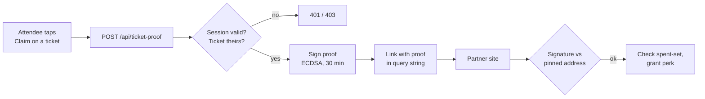

# Partner ticket proofs

Lets a third party (ENS first) confirm that someone holds a Devcon ticket, and
which tier it is, without learning who they are. We issue, they verify.

## What a proof says

Exactly two facts, plus an expiry:

- **identifier**: a stable pseudonym for one ticket. Same ticket always gives the
  same value, so the partner can enforce one perk per ticket.
- **tier**: `india` or `standard`.

It carries no email, name, order code, barcode, price or product name.

## Flow



We are not involved after the redirect. There is no callback.

## Verifying (partner side)

1. Parse the query params into a proof.
2. Rebuild the digest: `keccak256(abi.encode(domain, identifier, tier, partner, event, exp))`,
   where `domain` is `devcon-ticket-proof-v1`.
3. Recover the EIP-191 signer from `sig` and compare it to **our pinned
   address**. Get that address once from `GET /api/ticket-proof/signer` and hard
   code it. Never read it from the link.
4. Reject if `exp` has passed, then check your own spent-set.

`abi.encode` (not `encodePacked`) so every field is length-prefixed, which also
means the digest is reproducible onchain if a perk ever needs `ecrecover` in a
contract.

## The partner owns replay protection

Store `identifier` on first claim and refuse it afterwards, one perk per ticket,
first claim wins. This is the real defence. The 30 minute expiry only stops a
link being hoarded and reshared later, it does nothing about the same link being
used twice inside the window.

The expiry is deliberately generous because the attendee has to leave the PWA,
land in another browser, and connect a wallet before claiming. If you consume the
proof on arrival and swap it for your own session (the way Meerkat treats its
handover token), a much shorter window costs nothing.

## Tier mapping

`india` covers India Early Bird, India Resident and Indian Students. Set
`TICKET_PROOF_INDIA_ITEM_IDS` to pin exact Pretix item ids; with it unset we
match `India`/`Indian` in the product name, which separates those three from
`Student Discount` and `Youth Ticket` correctly.

Everything else is `standard`. The enum is signed over, so changing it
invalidates every proof already issued.

## Endpoints

| Route | Purpose |
| --- | --- |
| `POST /api/ticket-proof` | Mint a proof. Needs a Supabase bearer token. Body: `{ ticketSecret, partner }`. |
| `GET /api/ticket-proof/signer` | Public signer address, domain and version. For pinning at setup. |

Swag and add-ons cannot be proved: only event-ticket secrets are matched.

## Config

Server-only, see `.env.example` for the full notes.

- `TICKET_PROOF_PRIVATE_KEY`: dedicated signing key. Must not hold funds, and
  must not be the payment relayer key.
- `TICKET_PROOF_SALT`: keys the identifier hash. Never publish it. The ticket
  secret is the QR payload, so a bare hash of it would let anyone who has seen a
  badge deanonymise that attendee's claim.
- `TICKET_PROOF_INDIA_ITEM_IDS`, `TICKET_PROOF_ENS_CLAIM_URL`: optional.

Rotating the key invalidates issued proofs and every partner's pin. Changing the
salt changes every identifier, so partners' spent-sets stop matching and spent
tickets could claim again.

## Reference implementation

`/demo/ens-perks` is a working partner side, built by us as an integration
example. Not ENS, not affiliated with ENS, no ENS branding. It verifies against
the pinned address, honours the expiry, keeps a spent-set, and stubs the wallet
connection (how long an address has held an ENS name is the partner's own
onchain lookup and needs nothing from us).

Its spent-set is an in-memory map, so it resets on restart and would not hold
across serverless instances. Production needs a unique constraint in a database.
The page has a **Reset demo claims** control for repeat demos.

`/demo/**` and `/api/demo/**` are POC-only and should be dropped or blocked
before this ships.

```bash
pnpm proof:test                    # signing, tampering, expiry, tier rules
pnpm proof:demo-link india         # print a ready-made claim link
pnpm proof:demo-link standard --expired
```

## Leaving the PWA

There is no way to force the default browser from an installed PWA. iOS opens
out-of-scope links in an in-app view with no escape API, Android uses a Custom
Tab. This matters because the partner page needs a wallet, and deep-linking to a
wallet app from an in-app view (and getting back) is where it breaks.

So the proof is minted *before* the hand-off button appears, leaving the escape
attempt as a bare synchronous action on the user's tap (iOS blocks hand-offs not
tied directly to a gesture, and an `await` in between is enough to lose it).
From there: `x-safari-https://` on iOS, the native share sheet where available,
and a copyable link as the floor. Outside a PWA it is just a new tab.

## Why not reuse the Meerkat handover

Same shape, and `/api/ticket-proof` is modelled on `/api/meerkat`. The token
differs on three points: HS256 is symmetric, so a partner able to verify is also
able to mint the perks it grants; the payload carries a raw email; and it says
nothing about tier.
