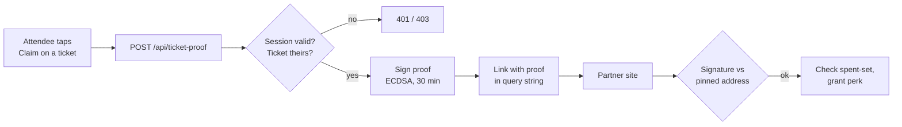

# Partner ticket proofs

Lets a third party (ENS first) confirm that someone holds a Devcon ticket, and
which tier it is, without learning who they are. We issue, they verify.

## What a proof says

Exactly two facts, plus an expiry:

- **identifier**: a stable pseudonym for one ticket. Same ticket always gives the
  same value, so the partner can enforce one perk per ticket.
- **tier**: `india` or `standard`.

It carries no email, name, order code, barcode, price or product name.

## Flow



We are not involved after the redirect. There is no callback.

## Verifying (partner side)

1. Parse the query params into a proof.
2. Rebuild the digest: `keccak256(abi.encode(domain, identifier, tier, partner, event, exp))`,
   where `domain` is `devcon-ticket-proof-v1`.
3. Recover the EIP-191 signer from `sig` and compare it to **our pinned
   address**. Get that address once from `GET /api/ticket-proof/signer` and hard
   code it. Never read it from the link.
4. Reject if `exp` has passed, then check your own spent-set.

`abi.encode` (not `encodePacked`) so every field is length-prefixed, which also
means the digest is reproducible onchain if a perk ever needs `ecrecover` in a
contract.

## The partner owns replay protection

Store `identifier` on first claim and refuse it afterwards, one claim per perk
per ticket, first claim wins (a partner granting several independent perks keys
the spent-set by identifier + perk, so claiming one does not spend the others).
This is the real defence. The 30 minute expiry only stops a
link being hoarded and reshared later, it does nothing about the same link being
used twice inside the window.

The expiry is deliberately generous because the attendee has to leave the PWA,
land in another browser, and connect a wallet before claiming. If you consume the
proof on arrival and swap it for your own session (the way Meerkat treats its
handover token), a much shorter window costs nothing.

## Tier mapping

Detected from the product, in two structural steps. The catalogue is not
duplicated here, so new products need no code change.

1. **Is it a ticket?** Only positions carrying Pretix's `admission` flag are
   provable. This is a different question from "is it an add-on": merchandise can
   be sold as its own position, so an add-on filter alone would let a scarf
   through as a provable ticket.
2. **Is it India?** The 🇮🇳 flag in the product name, which the ticketing team
   puts on the India-priced products. Everything else is `standard`.

The flag rather than the word "India", because Devcon 8 *is in* India: a name
like "Devcon India ..." records where the event is, not that the holder got a
discount. A word match would hand a subsidized registration to every attendee the
moment someone renamed the main product, and it also reads the "Devcon India
Scarf" merchandise as India tickets. The flag is a deliberate marker; the country
name is ambient.

Anything not positively identified as India is `standard`, new products
included. That is the direction to fail: `standard` given wrongly means a
smaller gift and is trivially fixed, while `india` given wrongly has already
cost a subsidized registration.

A product that mentions India but carries no flag is logged as a warning and
treated as `standard`, so an unflagged India ticket surfaces instead of silently
mis-tiering. Names like "Daily India Pass" land here: whether a daily pass counts
is a judgement call, not something a rule should settle quietly.

`TICKET_PROOF_INDIA_ITEM_IDS` is the escape hatch for a product that cannot
follow the convention. When set it is exclusive: only those ids are india.

The tier enum is signed over, so changing it invalidates every proof already
issued.

## Endpoints

| Route | Purpose |
| --- | --- |
| `POST /api/ticket-proof` | Mint a proof. Needs a Supabase bearer token. Body: `{ ticketSecret, partner }`. |
| `GET /api/ticket-proof/signer` | Public signer address, domain and version. For pinning at setup. |

Swag and add-ons cannot be proved: a position must both be a non-add-on and
carry Pretix's `admission` flag.

## Config

Server-only, see `.env.example` for the full notes.

- `TICKET_PROOF_PRIVATE_KEY`: dedicated signing key. Must not hold funds, and
  must not be the payment relayer key.
- `TICKET_PROOF_SALT`: keys the identifier hash. Never publish it. The ticket
  secret is the QR payload, so a bare hash of it would let anyone who has seen a
  badge deanonymise that attendee's claim.
- `TICKET_PROOF_INDIA_ITEM_IDS`, `TICKET_PROOF_ENS_CLAIM_URL`: optional.

Rotating the key invalidates issued proofs and every partner's pin. Changing the
salt changes every identifier, so partners' spent-sets stop matching and spent
tickets could claim again.

## Reference implementation

`/demo/ens-perks` is a working partner side, built by us as an integration
example. Not ENS, not affiliated with ENS, no ENS branding. It verifies against
the pinned address, honours the expiry, and keeps a spent-set.

Its example rules grant two independent perks, and the claim route
(`POST /api/demo/ens-claim`) requires the caller to name one
(`perk: "subsidy" | "frens"`), checking eligibility against the tier
server-side:

- **subsidy** (`india` tier only): a subsidized first-year .eth registration.
  The picked name is validated (5+ character label); the registration itself is
  stubbed.
- **frens** (every tier): a long-term-user reward graded on how many years
  remain on an ENS name the attendee's wallet controls. The panel connects an
  injected wallet, reverse-resolves its primary name, and reads the real expiry
  from the .eth base registrar on mainnet — falling back to a manual input when
  there is no browser wallet, no primary name, or the name is not a direct
  .eth 2LD. The resulting number still travels client→server inside the demo;
  a real partner would re-derive it onchain server-side rather than trust the
  client.

A refused claim (name too short, not enough years remaining) grants nothing and
does not spend the ticket, so the attendee can fix the input and retry with the
same proof.

The spent-set is keyed by identifier + perk, so claiming one perk does not
spend the other. It is an in-memory map, so it resets on restart and would not
hold across serverless instances; production needs a unique constraint in a
database. The page has a **Reset demo claims** control for repeat demos.

`/demo/**` and `/api/demo/**` are POC-only and should be dropped or blocked
before this ships.

```bash
pnpm proof:test                    # signing, tampering, expiry, tier rules
pnpm proof:demo-link india         # print a ready-made claim link
pnpm proof:demo-link standard --expired
```

## Not implemented yet

**Check-in gating.** A proof is currently issuable whether or not the attendee
has arrived, so a resold or unused ticket can still collect a perk.
`hasCheckedIn` is already on the ticket, so the gate itself is a one-line change
in `src/app/api/ticket-proof/route.ts` (see the TODO there). Two decisions come
with it: perks become onsite-only, and the partner may want check-in bound *into*
the proof rather than merely checked at mint time, which is a payload change and
so needs a `PROOF_DOMAIN` version bump.

## Leaving the PWA

There is no way to force the default browser from an installed PWA. iOS opens
out-of-scope links in an in-app view with no escape API, Android uses a Custom
Tab. This matters because the partner page needs a wallet, and deep-linking to a
wallet app from an in-app view (and getting back) is where it breaks.

So the proof is minted *before* the hand-off button appears, leaving the escape
attempt as a bare synchronous action on the user's tap (iOS blocks hand-offs not
tied directly to a gesture, and an `await` in between is enough to lose it).
From there: `x-safari-https://` on iOS, the native share sheet where available,
and a copyable link as the floor. Outside a PWA it is just a new tab.

## Why not reuse the Meerkat handover

Same shape, and `/api/ticket-proof` is modelled on `/api/meerkat`. The token
differs on three points: HS256 is symmetric, so a partner able to verify is also
able to mint the perks it grants; the payload carries a raw email; and it says
nothing about tier.
